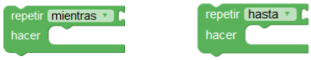
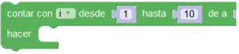
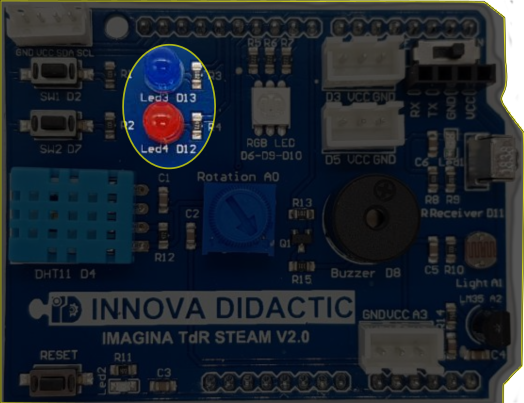
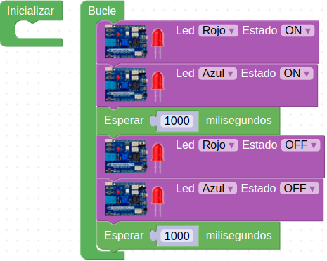
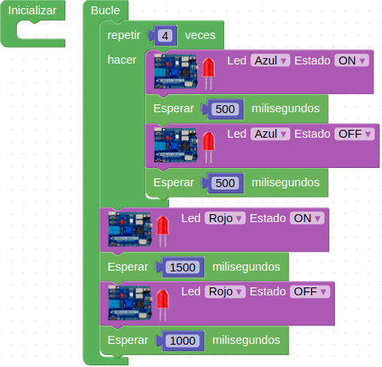
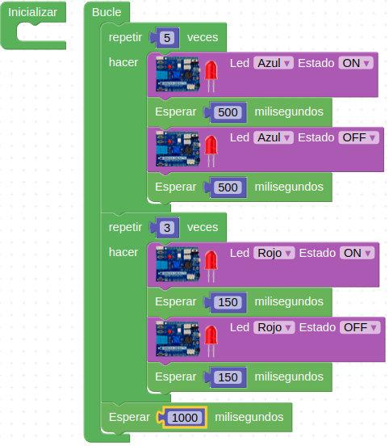

# Actividad-02. LEDs rojo y azul

## Enunciado
Como ya hemos visto anteriormente la placa dispone de dos LED (uno rojo y otro azul). Vamos a realizar un programa para que se vayan alternando en su encendido y apagado.

## Teoría
Vamos a ver como se hacen los ciclos de repetición o bucles en ArduinoBlocks. 

* **Repetir**. En el menú de Control existe el bloque 'Repetir (valor) veces hacer…', como el de la imagen siguiente:

*Bucle repetir*

Lo que pongamos en hacer se va a repetir tantas veces como indiquemos en el número de veces, que por defecto estará a 10.

En realidad lo que estamos haciendo es lo que en programación se conoce como bucle for.

* **Repetir según condición**. En la imagen siguiente vemos dos bloques que repiten su interior mientras, o hasta, que se cumpla una condición.

*Bucle repetir según condición*

* **Contador**.  Realiza un bucle contando con un variable índice (normalmente i o j). Se define un valor de inicio, una valor de fin y los incrementos que se realizarán en cada iteración del bucle. Dentro del bucle podremos usar esta variable índice.

*Bucle contador*

## En la TdR STEAM

*Los dos LEDs de la TdR-STEAM*

## Programando la Actividad
Vamos a hacer que ambos diodos se enciendan y apaguen de forma simultanea con un programa como el siguiente, que lo tenemos disponible en [Actividad-02. LED-rojo-azul](./programas/ESP32-SM-Actividad-02.abp)

*Intermitencia LEDs rojo y azul*

## Retos de ampliación

**A2.R1**. Hacer que los LEDs rojo y azul se enciendan simultáneamente con tiempos de espera de 300ms y 150ms respectivamente.

**A2.R2**. Realizar 4 intermitencias de 500ms con el LED azul y cuando estas acaben dejar el LED rojo encendido durante 1.5 segundos. Esperar un segundo para iniciar de nuevo el proceso.

**A2.R3**. Realiza 5 intermitencias de 500ms con el LED azul cada vez que el LED rojo lo hace 3 veces a intervalos de 150ms. Esperar un segundo para iniciar de nuevo el proceso.

### Solución A22.R2
El Programa es el de la imagen siguiente:

*Solución al Reto 2 de la Actividad 2*

### Solución A2.R3
El Programa es el de la imagen siguiente:

|  |

*Solución al Reto 3 de la Actividad 2*

