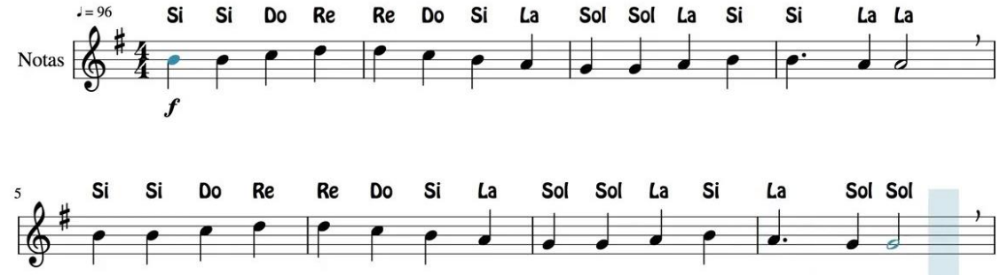

# Actividad-05. Zumbador

## Enunciado
Trabajaremos con el buzzer o zumbador partiendo de la reproducción de sonidos básicos hasta llegar a la reproducción de melodías completas.

## Teoría
El buzzer, zumbador o altavoz es un transductor electroacústico (convierte una señal eléctrica en una onda de sonido) que produce un determinado zumbido o sonido. Existen de dos tipos:

* *Pasivos*: no disponen de electrónica interna, por lo que tenemos que proporcionar una señal eléctrica para conseguir el sonido deseado.
* *Activos*: disponen de un oscilador interno, por lo que únicamente tenemos que alimentar el dispositivo para que se produzca el sonido.

### Zumbador pasivo
El zumbador que incorpora la placa TdR STEAM es de tipo pasivo y está conectado al pin D8.

Una de los parámetros que caracterizan a un sonido es su frecuencia de emisión, siendo la frecuencia el número de veces que se repite por unidad de tiempo (segundo). La transmisión del sonido se realiza por ondas a través en cualquier medio (sólido, líquido o gaseoso) excepto en el vacío. La frecuencia de un sonido nos indica cuantos ciclos por segundo tiene una onda.

En la imagen y la tabla siguientes vemos un dibujo con un fragmento de las teclas de un piano estando todo referido a una nota estándar, la nota "La" central que tiene una frecuencia de 440 Hz. Podemos ver la nota musical que reproduce, en las dos notaciones más comunes de los sonidos (Inglés: C D E F G A B, Alemán: C D E F G A H, Español, italiano y francés: Do Re Mi Fa Sol La Si) y además se encuentra la frecuencia que produce esa nota musical.

*Sección de piano y notas*

### Bloques de programación
En ArduinoBlocks disponemos de un bloque que nos permite reproducir cualquier melodía RTTTL (del inglés, Ring Tone Text Transfer Language) y es el que vemos en la imagen siguiente:

*Bloque Reproducir RTTTL*

Este bloque permite reproducir una melodía a partir de un texto con formato RTTTL, formato desarrollado por Nokia para ser usado para transferir tonos de llamada a teléfonos móviles. El formato RTTTL es una cadena dividida en tres secciones: nombre, valor predeterminado y datos. Por ejemplo, la siguiente cadena de texto se corresponde con la Intro de Donkey Kong:

 d=4,o=5,b=140:8a#,8p,8d6,16p,16f.6,16g.6,16f.6,8a#,8p,8d6,16p,16f.6,16g.6,16f.6,8a#,8p,8d6,16p,16f.6,16g.6,16f.6,8a#,8p,8d6,16p,16f.6,16g.6,16f.6

Lo único que tenemos que hacer para reproducir la melodía es pegar esta cadena en la zona de texto del bloque.

ArduinoBlocks nos suministra información y enlaces referentes al tema accediendo desde nuestro proyecto a herramientas y escogiendo RTTTL Info, tal y como vemos en la imagen siguiente:

*Acceso a RTTTL Info*

En la imagen siguiente tenemos desplegada la información que nos ofrece esta herramienta.

*Información RTTTL*

También podemos acceder a esta información haciendo clic derecho sobre el bloque y escogiendo la opción "Ayuda" de entre las mostradas en la ventana emergente.

### Zumbador activo
Existe otro tipo de zumbador que incluye un oscilador que genera una frecuencia audible fija y que se conoce como zumbador pasivo y en realidad es el que de forma correcta se puede denominar como zumbador. Este es mucho mas sencillo de usar ya que basta con conectarlo a un pin digital y cuando pongamos a nivel alto este pin el zumbador generará su zumbido característico durante el tiempo que establezcamos. Con este tipo de zumbador no se pueden generar melodías.

Cuando está nuevo se distingue del zumbador pasivo o altavoz por la pegatina de protección que lo acompaña, pero esta hay que quitarla para oir el zumbido y sin ella es difícil distinguir un tipo del otro, así que en este caso deberemos crear un programa con alguna melodía y si no se reproduce correctamente es que tenemos conectado el zumbador activo en lugar del pasivo. Lo mejor es marcar alguno de los dos cuando podemos distinguirlos. Una buena idea puede ser utilizar la propia pegatina en el lateral del mismo.

## En la TdR STEAM

*El buzzer en la TdR STEAM*

## Programando la actividad
Los cuatro bloques destinados a trabajar con el zumbador los vemos en la imagen siguiente:

*Los 4 bloques para trabajar con el zumbador*

En el bloque Zumbador podemos modificar dos parámetros, el tiempo que dura cada sonido expresado en milisegundos (campo Ms) y la frecuencia en Hz a la que reproducirá el sonido el zumbador (campo Hz).

Vamos a comenzar haciendo un programa que reproduzca tres de las notas de la escala musical vista anteriormente. La solución al reto la tenemos disponible en [Actividad-05](./programas/ESP32-SM-Actividad-05.abp).

*Actividad-05*

## Retos de ampliación

**A5.R1**. Reproducir la escala musical con las notas básicas utilizando los bloques Zumbador y Tono

**A5.R2**. Reproducir la melodía de la imagen siguiente sabiendo que las negras tienen una duración de 500ms, las negras con un puntito 750ms y las blancas 1000ms.

*Himno a la alegria*

**A5.R3**. Reproducir diferentes melodías a partir de los bloques RTTTL (Ring Tone Text Transfer Language o lenguaje de tonos de llamada).

**A5.R4**. Reproducir alguna otra melodía que descarguemos de las páginas web propuestas.
