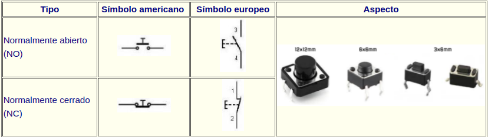

# Actividad-06. Pulsadores

## Enunciado
Utilizaremos uno, o ambos pulsadores, para llevar a cabo determinadas tareas como respuesta al accionamiento de los mismos.

## Teoría

### El pulsador

En la tabla siguiente vemos la simbología y algunos ejemplos del aspecto físico de estos elementos.

*Símbolos y aspecto real de un pulsador*

Se trata de un dispositivo que es capaz de abrir o cerrar el paso de la corriente eléctrica mientras permanece accionado, es decir, su función no queda anclada como por ejemplo en los interruptores de la luz de casa, en donde el accionamiento permanece hasta que no se vuelve a accionar. En un pulsador, por contra, su activación dura mientras lo mantenemos pulsado y vuelve a su estado de reposo en cuanto dejemos de pulsarlo.

Mediante la configuración adecuada podemos convertir un pulsador en un elemento de entrada a algún pin de nuestra placa UNO. Las configuraciones más básicas posibles con pulsadores las podemos ver en la imagen siguiente.

*Configuración circuito elemental con pulsador*

En el caso de la TdR STEAM los pulsadores se han configurado para que en reposo pongan a cero su entrada digital correspondiente y que se ponga a uno cuando son accionados.

### Concepto de variable y de contador
El concepto de variable en programación consiste simplemente en asignarle un nombre significativo a un espacio de memoria donde almacenar determinada información durante la ejecución normal del programa. El concepto es muy amplio y complejo y en nuestro caso no vamos a entrar en detalles sobre el mismo, pero si indicar que no se debe confundir con el concepto de variable matemática, ya que una expresión como x = x + 1 que es una aberración en matemáticas tiene todo el sentido en programación. Lógicamente en matemáticas no se puede cumplir pero en programación significa que a la variable x se le sume uno y el resultado se vuelva a guardar en la misma variable.

En ArduinoBlocks podemos crear tres tipos de variables, numéricas, de texto o booleanas. En la animación siguiente podemos ver como se pueden crear, eliminar y renombrar variables.

*Crear, renombrar y eliminar variables*

En programación, llamamos contador a una variable cuyo valor se incrementa o decrementa en un valor fijo para cada iteración del bucle para el que se ha definido. El uso habitual de un contador es simplemente contar el número de veces que itera un bucle en general o de forma mas extensa contar, solamente, aquellas iteraciones en las que se cumpla una determinada condición.

Por ejemplo, supongamos que tenemos una variable de nombre Estado de valor inicial cero y que se incremente cada vez que accionamos un pulsador, de esta forma si en un bucle vamos incrementando la variable de uno en uno, tenemos:

<B><BLOCKQUOTE> Estado = 0 // valor inicial

Estado = 1 // Estado = Estado + 1

Estado = 2 // Estado = Estado + 1

... </BLOCKQUOTE></B>

### Condicionales
Las sentencias condicionales son aquellas que nos permiten tomar decisiones en función de si ocurre o no ocurre determinada cosa. En el caso de ArduinoBlocks estas las podemos encontrar en el bloque lógica. Este bloque contiene los elementos que vemos en la imagen siguiente:

*Bloques de lógica*

El funcionamiento es el siguiente: se evalúa la condición que ponemos en "si" y si el resultado es verdadero, o sea condición cierta, se realizan las acciones que pongamos en "hacer" y si no es cierta dichas acciones no se realizan. En el apartado condición se pueden poner infinidad de factores como pueden ser el estado de sensores, realizar comparaciones, hacer operaciones matemáticas, etc. Lógicamente el resultado de evaluar la condición debe ser verdadero o falso lo que se resuelve en el caso de la programación en Arduino diciendo que si el resultado es 0, el resultado de la evaluación es falso y si es 1 o cualquier otro valor es verdadero.

Si hemos sido observadores hemos visto en los bloques "si" de "Lógica" un signo mas (+) en la parte superior izquierda tanto del condicional "if" como la del "if ... else" tal y como se destaca en la imagen siguiente.

*Añadir opciones else if*

Cada vez que pulsemos sobre el signo mas se añadirá una cláusula "else if" a la principal y podemos añadir tantas como necesitemos. Esta cláusula nos va a permitir establecer una nueva condición.En la imagen siguiente vemos añadidas dos para el caso de "if ... else". En la imagen observamos el código equivalente y las distintas condiciones que se pueden establecer.

*Clausula if...else con dos else if*

El signo menos (-) que aparece en la imagen sirve para eliminar la correspondiente cláusula "else if".

## En la TdR STEAM
La placa TdR STEAM dispone de dos pulsadores denominados SW1 y SW2 y conectados a los pines digitales D2 y D7 respectivamente.

*Pulsadores en la TdR STEAM*

## Programando la actividad
La aplicación de un pulsador para hacer algo requiere saber si este esta pulsado o no lo está y para ello vamos a necesitar de las sentencias condicionales que hemos visto anteriormente.

Vamos a hacer un programa en el que preguntemos si el pulsador SW1 (D2) está o no pulsado y si lo está que se encienda el LED rojo (D12) y si no lo pulsamos que permanezca apagado. La solución al reto la tenemos disponible en [Actividad-06](./programas/ESP32-SM-Actividad-06.abp). A modo de comentario se ha colocado otra forma de realizar la misma programación que podemos probar simplemente arrastrando el bloque que hay en bucle fuera del mismo y colocando el otro en su lugar.

*Actividad-06*

## Ampliación sobre programación de la actividad
Ya se ha explicado el funcionamiento del signo mas (+) de la parte superior izquierda tanto del condicional "if" como la del "if ... else". Cada vez que pulsemos sobre el signo mas se añadirá una cláusula "else if" a la principal y podemos añadir tantas como necesitemos. Esta cláusula nos va a permitir establecer una nueva condición. El signo menos (-) que aparece en la imagen sirve para eliminar la correspondiente cláusula "else if".

Vamos a hace un programa similar a la Actividad-06 para hacer que si pulsamos SW2 se encienda el LED azul y si no está pulsado permanecerá apagado. La solución la tenemos disponible en [Actividad-06-ampliación-1](./programas/Actividad-06-ampliacion-1.abp).

*Actividad-06-ampliacion-1*

El siguiente programa hará que se encienda el LED azul al pulsar SW1 y el LED rojo al pulsar SW2 se encienda el rojo permaneciendo apagados si no están pulsados. Observese la primera condición AND (Y) que impide que si pulsamos ambos pulsadores al mismo tiempo se enciendan los LEDs. La solución la tenemos disponible en [Actividad-06-ampliación-2](./programas/Actividad-06-ampliacion-2.abp).

*Actividad-06-ampliacion-2*

## Retos de ampliación

**A6.R1**. Resolver el reto inicial de forma que el funcionamiento sea al contrario, es decir, que el LED rojo esté siempre encendido y al pulsar SW1 se apague.

**A6.R2**. Hacer un programa que al pulsar SW1 se encienda el LED azul y que al pulsar SW2 se apague. Como ampliación se sugiere modificar el programa para que encienda y apague los dos LEDs a un tiempo.

**A6.R3**. Hacer un programa que emita, usando SW1 como si fuese un telégrafo, el código Morse universal de solicitud de socorro, SOS.

**A6.R4**. Hacer un programa que al pulsar SW1 encienda el LED azul y que este permanezca encendido hasta que no pulsemos SW1 dos veces mas (3 pulsaciones en total), en cuyo caso se apagará.

### Solución A6.R1
La solución está en utilizar el operador NOT. El Programa es el de la imagen siguiente:

*Reto 1 de la actividad 6*

### Solución A6.R2
La solución en esta ocasión está en utilizar el operador NOT y el operador AND. El Programa es el de la imagen siguiente:

*Reto 2 de la actividad 6*

### Solución A6.R3
El alfabeto Morse lo vemos en la imagen siguiente, donde podemos observar que la S son tres puntos o pulsaciones cortas y la O son tres rayas o pulsaciones largas. Sin entrar en mas detalles daremos la solución considerando SOS como una palabra (es lo universalmente adoptado) de forma que no haremos pausas entre letras.

*Alfabeto Morse*

El Programa es el de la imagen siguiente:

*Reto 3 de la actividad 6*

### Solución A6.R4
Definimos una variable y la utilizamos para resolver el programa mediante un contador. El Programa es el de la imagen siguiente:

*Reto 4 de la actividad 6*

