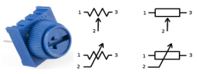
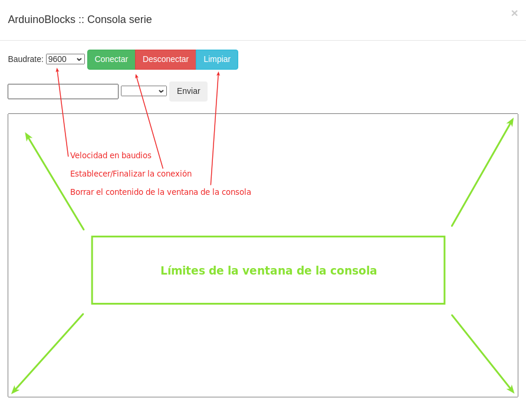

# Actividad-07. El potenciómetro

## Enunciado
Introducir el uso de las entradas analógicas para visualizar los cambios que hagamos con el potenciómetro en el terminal serie o consola serie. Cuando hablamos de lecturas analógicas suele ser muy útil el uso del mapeo, concepto que también vamos a introducir y que veremos en la segunda parte del reto.

## Teoría
Antes de nada ya hemos indicado que el potenciometro va conectado a un pin analógico y es en este momento cuando vamos a establecer la diferencia entre los conceptos de analógico y de digital.

Una clasificación de los circuitos electrónicos es dividirlos en dos grandes categorías: digitales y analógicos.

* La electrónica digital utiliza magnitudes con dos valores discretos conocidos como 0 - 1, alto - bajo, on - off, etc, y que se corresponden con la presencia o no de tensión en un determinado punto.
* La electrónica analógica emplea magnitudes con valores continuos. En concreto en las placas En la ESP32 Plus STEAMakers, las entradas analógicas pueden tener 2^12 valores (12 bits
de resolución = 4.096 valores), es decir, valores comprendidos entre 0 y 4.095. Estos valores se pueden expresar de forma numérica o de forma porcentual, correspondiendo el 0 a un 0% y el 4.095 al 100%.

### El potenciómetro
En la imagen siguiente vemos el aspecto de un modelo concreto de potenciómetro así como los símbolos habituales del mismo. La numeración indica lo siguiente:

* Terminales 1 y 3 son los contactos unidos a los extremos de la resistencia fija o resistencia total del potenciómetro.
* Terminal 2 es el contacto que va unido al cursor o parte móvil que se desliza sobre la resistencia fija haciendo que la resistencia entre un terminal y el cursor varíe en función de la posición de este.

*Aspecto y símbolo del potenciómetro*

La posición del cursor se determina de forma mecánica y son adecuados para usarlos como elementos de control de tensión (conexión en serie) o de corriente (conexión en paralelo). Los potenciómetros del tipo que estamos viendo (existen de otros muchos tipos) tienen un funcionamiento en forma de rotación con un ángulo de unos 270 grados entre los puntos mas extremos.

### El terminal o consola serie
Sirve para visualizar en un ordenador los datos recibidos a través del puerto serie y en realidad es una aplicación que controla las comunicaciones bidireccionales a través de la UART integrada en el microcontrolador.

Es muy importante tener siempre presente que el puerto serie es el que se utiliza para "subir" el firmware o programa a la placa, tarea que se realiza a través de una aplicación pregrabada en el microntrolador y que se denomina "bootloader".

En ArduinoBlocks es posible usar la consola serie solamente si tenemos instalada y en funcionamiento la aplicación ArduinoBlocks-Connector que es la encargada de establecer las comunicaciones locales de nuestra placa con las remotas de la aplicación. En la imagen siguiente vemos el aspecto de la consola.

*Aspecto de la Consola en AB*

A la hora de establecer una conexión serie los dos extremos que intervienen en la conexión (placa ESP32 STEAMakers y ordenador) deben establecer el mismo valor en la velocidad de la conexión. Por defecto esta velocidad es de 115200 baudios o bits por segundo en el bloque inicializar y otras velocidades comunmente utilizadas son: 4800, 9600, 19200, 38400, 57600. Es por lo tanto imprescindible incluir en el bloque "Inicializar" el bloque "Iniciar" y establecer la velocidad de comunicación.

### Serial Plotter - Datalogger
Es otra funcionalidad relacionada con la comunicación serie que nos permite visualizar información en forma de gráfica en tiempo real. Además el “Serial Plotter” implementa un sencillo datalogger con el que podemos ir grabando los datos para exportarlos posteriormente. En ArduinoBlocks existen bloques que nos permiten trabajar con el serial plotter. El serial plotter + datalogger se activa haciendo clic en la flecha a la derecha de Consola y tiene el aspecto que vemos en la imagen siguiente:

*Serial Plotter + Datalogger*

### Mapeo
Hemos indicado que las entradas analógicas trabajan con 12 bits, o sea valores comprendidos entre 0 y 4095 (2^12) y también que las salidas digitales trabajan con 8 bits, o sea valores entre 0 y 255 (28), por lo que si queremos combinar en nuestro programa entradas analógicas con salidas digitales debemos realizar un ajuste de escala en los datos. A este ajuste se le conoce como "mapear" y es un bloque disponible en el menú Matemáticas con el aspecto de la imagen siguiente:

*Bloque mapear*

## En la TdR STEAM

*El potenciometro de la TdR STEAM*

## Programando la actividad

* **Parte 1**. Vamos a guardar los datos leídos del potenciómetro en una variable y mostrarlos a través de la consola serie. La solución la tenemos disponible en [Actividad-07: Parte 1](./programas/ESP32-SM-Actividad-07-P1.abp) que es el programa que vemos en la imagen siguiente:

*Parte 1 de la actividad 7*

Si cargamos el programa en nuestra placa y posteriormente activamos la consola y conectamos ArduinoBlocks con nuestro ordenador podemos ver un resultado similar al de la imagen siguiente que se corresponde con variaciones de extremo a extremo del potenciómetro.

*Aspecto de la consola*

Para entender el significado del check "salto de linea" del bloque "Enviar" podemos desactivarlo y volver a hacer el mismo proceso.

***

 ¡MUY IMPORTANTE! cuando terminemos de manipular el potenciómetro que el mismo esté totalmente girado a la posición izquierda (punto de color magenta), ya que comparte la conexión A0 (GPIO02) con el sistema de grabación del programa. Si no está en esa posición se producirá un error en el envío del programa. 

***

* **Parte 2**. Vamos a modificar el programa de la parte 1 del reto para mapear los datos antes de enviarlos a la consola serie. La solución la tenemos disponible en [Actividad-07: Parte 2](./programas/ESP32-SM-Actividad-07-P2.abp) que es el programa que vemos en la imagen siguiente:

*Parte 2 de la actividad 7*

El resultado ahora lo vemos en la imagen siguiente:

*Aspecto de la consola*

* **Ampliación**. Vamos ahora a mapear y mostrar los datos leídos del potenciómetro en el Serial Plotter. La solución la tenemos disponible en [Actividad-07: Ampliacion](./programas/ESP32-SM-Actividad-07-Amp.abp) que es el programa que vemos en la imagen siguiente:

*Ampliación de la actividad 7, serial plotter*

Si activamos el Serial Plotter y vamos variando el potenciometro veremos el resultado en el mismo, obteniendo algo similar a la imagen siguiente:

*Aspecto del Serial plotter*

## Retos de ampliación

**A7.R1**. Utilización del bloque "crear texto con ..." del menú "Texto". Utilizaremos cualquiera de los programas vistos en la actividad y configuraremos el nuevo bloque para que en cada línea nos muestre el mensaje "El valor del potenciometro es: ", a continuación nos muestre el valor y tras el mismo el símbolo % porque configuraremos la lectura en porcentaje. Dejaremos transcurrir un tiempo de 3s entre cada muestra de salida por consola.

**A7.R2**. Control del LED RGB con el potenciometro. Vamos a dividir el rango total en 8 partes y asignarle a cada una de ellas uno de los colores RGB según vemos en la tabla siguiente:

| Color | Rango | R | G | B |
|---|:|:|:|:|
| Rojo | 0 a 512 | 255 | 0 | 0 |
| Verde | 513 a 1023 | 0 | 255 | 0 |
| Azul | 1024 a 1536 | 0 | 0 | 255 |
| Amarillo | 1537 a 2048 | 255 | 255 | 0 |
| Cian | 2049 a 2560 | 0 | 255 | 255 |
| Magenta | 2561 a 3072 | 255 | 0 | 255 |
| Blanco | 3073 a 3584 | 255 | 255 | 255 |
| Naranja | 3584 a 4096 | 255 | 127 | 0 |

* **A7.R3**. Repetir el reto 2 de esta actividad pero ahora además mostrando por consola el valor del potenciometro.
