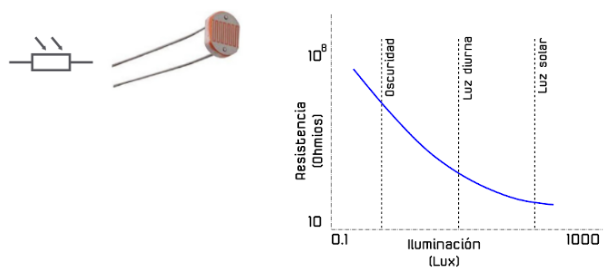
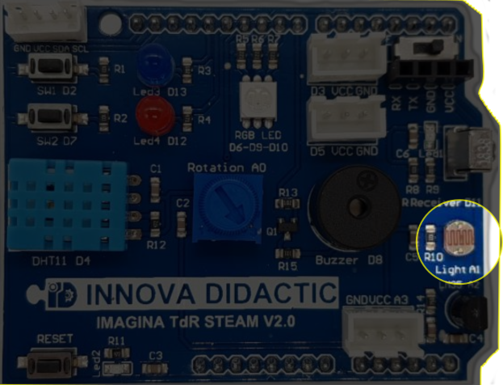
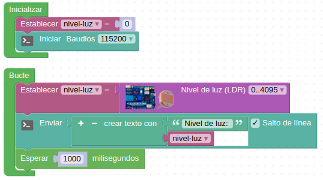
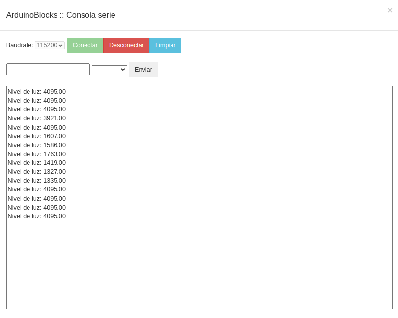

# Actividad-08. La fotorresistencia o LDR

## Enunciado
Utilizaremos la consola serie para mostrar los valores de luz detectados por la resistencia LDR o fotocélula.

## Teoría
Una fotorresistencia o fotorresistor es un componente electrónico cuya resistencia disminuye de forma exponencial con el aumento de la intensidad de luz incidente. Las siglas LDR vienen de su nombre en inglés, que es Light Dependent Resistor. En la imagen siguiente tenemos el símbolo, el aspecto real de una LDR y su curva característica de variación de resistencia con la iluminación.

*Símbolo y aspecto de la LDR y curva característica*

## En la TdR STEAM

| La LDR en la TdR STEAM |
|:|
|  |

## Programando la actividad
Dado que en el menú TDR STEAM de ArduinoBlocks tenemos disponible un bloque que nos devuelve el nivel de luz en porcentaje o de forma numérica, resolver la actividad es sumamente sencillo. La solución la tenemos disponible en [ESP32-SM-Actividad-08](./programas/ESP32-SM-Actividad-08.abp) que es el programa que vemos en la imagen siguiente:

*Actividad-08*

Esto nos generará algo como lo de la imagen siguiente en la consola:

*Consola que produce la actividad 8*

## Retos de ampliación

**A8.R1**. Detectar el nivel de iluminación de la sala y condiciones de iluminación en las que estemos utilizando la LDR y enviar el resultado a la consola.

**A8.R2**. Programar un interruptor crepuscular utilizando la LDR y uno de los LEDs para simular el farol. El nivel de luz mínimo permitido antes de encender el farol dependerá del resultado obtenido en la reto 1, de forma que con un valor menor o igual se encienda el LED y con un valor mayor permanezca apagado.

**A8.R3**. Hacer el interruptor crepuscular utilizando como farol en LED RGB que se encenderá en color blanco.
