# Actividad-09. El sensor de temperatura LM35D

## Enunciado
Utilizaremos este sensor de temperatura para medir la temperatura de la habitación en la que estemos resolviendo el reto mostrando el resultado en la consola.

## Teoría

### LM35
El LM35 es un circuito integrado de medida de temperatura de precisión con una tensión de salida lineal y proporcional a la temperatura en grados centígrados. Algunas de las características que se pueden extraer de la [hoja de datos del LM35](Datasheet/lm35.pdf) son:

* Directamente calibrado en grados Celsius (Centígrados)
* Factor de escala lineal de +10-mV/°C
* Resolución asegurada de 0.5°C
* Rango de medida de −55°C a 150°C

En la imagen siguiente vemos su representación en circuito y el aspecto físico que tiene en uno de sus encapsulados mas usual.

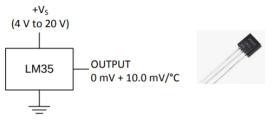

*Representación esquemática y aspecto*

### Bloques de tiempo
Para esta actividad vamos a explicar los bloques de tiempo que se implementan en ArduinoBlocks. Las funciones de tiempo o retardo nos permiten realizar pausas y obtener información sobre el tiempo transcurrido dentro del microcontrolador.

**1.- Bloques esperar**. Realizan una pausa del tiempo que establezcamos hasta seguir con la ejecución del siguiente bloque. Se corresponden con las instrucciones delay(1000) y delayMicroseconds(1000). Tenemos disponibles los dos de la imagen siguiente:

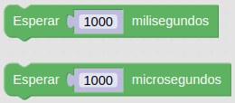

*Bloques esperar*

**2.- Tiempo transcurrido**. Obtiene un valor con el tiempo transcurrido desde el inicio o reset del microcontrolador de la placa ESP32 STEAMakers. Se trata de las funciones millis() y micros(). El valor puede ser en milisegundos o microsegundos, tal y como vemos en la imagen siguiente:

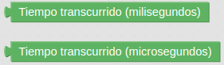

*Bloques tiempo transcurrido*

En la imagen siguiente tenemos un ejemplo de uso sacado del [manual del programa](https://docs.google.com/document/u/1/d/e/2PACX-1vQSrOKHpbLQHVbGFdAvp7DcndoftoHDI20nvwGMaxu_7bGc1bUCmi4U6DZrJWRSudc2iXBg43QMuzCT/pub): Ejecutar la Tarea1 cada 3 segundos y la Tarea2 cada 7 segundos ** sin bloquear la ejecución del programa **:

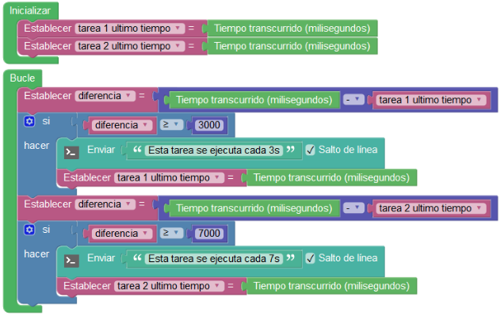

*Ejemplo de uso del bloque tiempo transcurrido*

**3.- Esperar por siempre**. Bloquea indefinidamente la ejecución finalizando por tanto el programa. Vemos el bloque en la imagen siguiente:

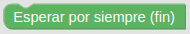

*Bloque esperar por siempre*

**4.- Ejecutar cada**. Es un bloque que **NO** bloquea la ejecución del programa y que implementa automáticamente la función millis(). En la imagen siguiente vemos su aspecto:

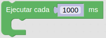

*Bloque ejecutar cada*

El resto de bloque y la ampliación de información la podemos consultar en el [manual del programa](https://docs.google.com/document/u/1/d/e/2PACX-1vQSrOKHpbLQHVbGFdAvp7DcndoftoHDI20nvwGMaxu_7bGc1bUCmi4U6DZrJWRSudc2iXBg43QMuzCT/pub).

### Funciones
Una función permite crear un grupo de bloques de código que realizan una determinada tarea y que se repite a lo largo del programa principal en varias ocasiones. Con la creación de una función evitamos repetir todos esos bloques y simplemente tendremos que invocar a la función. Es muy conveniente que los nombre que usemos sean lo mas descriptivos posibles de lo que hace la función. Existen dos tipos de funciones: las que no retornan un valor y las que si lo hacen. En la imagen siguiente vemos los bloques correspondientes a las mismas:

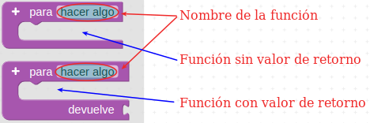

*Bloques para crear funciones en ArduinoBlocks*

Cuando creamos funciones automáticamente se crea el bloque con su nombre que permite invocarla, tal y como vemos en la imagen siguiente:

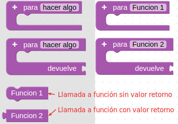

*Bloques para llamada a funciones*

También es posible crear funciones a las que se le envían datos o parámetros haciendo uso del signo + que aparece en los bloques. En la imagen siguiente vemos como le hemos añadido un par de parámetros a cada tipo de función y como se han modificado sus respectivos bloques de invocación.

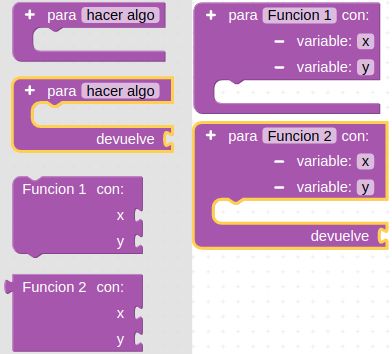

*Bloques para llamada a funciones con parámetros*

Un ejemplo típico descriptivo del funcionamiento de las funciones es el de calculo del área de un triángulo. Para ello definimos la función que realiza el cálculo, le pasamos dos parámetros, la base y la altura, realizamos los cálculos pitagóricos y nos devuelve el área del triángulo para esos datos. En la imagen siguiente tenemos la idea de resolución con la función creada y el bloque para llamarla.

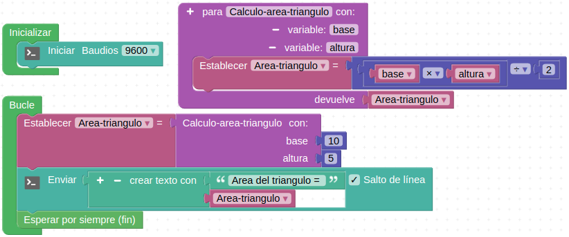

*Ejemplo de calculo del área de un triángulo*

En las imágenes siguiente vemos como se han creado diferentes funciones y la forma de llamarlas. En concreto se corresponden con la base del programa de [Educacont](http://educacont.org/) para configurar y grabar en la correspondiente estación. La primera función es "leer sensores" y la vemos en la imagen siguiente:

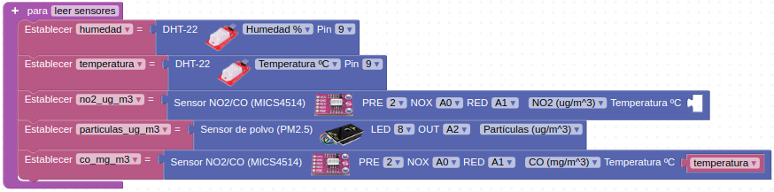

*Función leer sensores de Educacont*

En la imagen siguiente podemos ver la función encargada de subir los datos leídos a la nube.

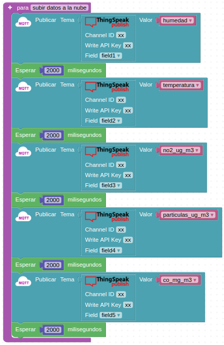

*Función subir datos a la nube de Educacont*

La siguiente función permite detener las mediciones durante 15 minutos.

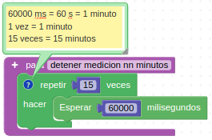

*Función detener medición nn minutos de Educacont*

El bucle principal tiene la configuración que vemos en la imagen siguiente:

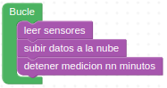

*Llamada a las funciones definidas*

## En la TdR STEAM

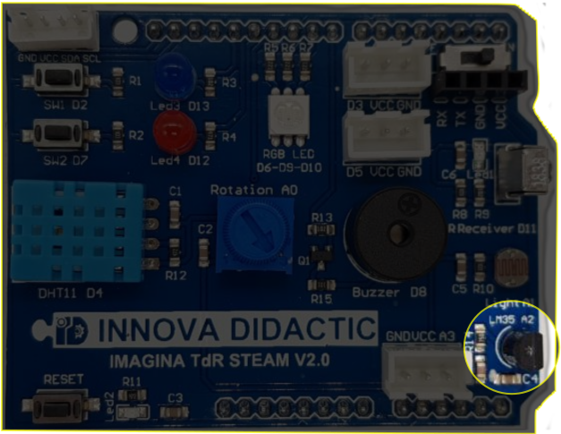

*El LM35 en la TdR STEAM*

## Programando la actividad
La programación de la actividad es muy similar a la de las anteriores y el programa [ESP32-SM-Actividad-09](./programas/ESP32-SM-Actividad-09.abp) es el que vemos en la imagen siguiente:

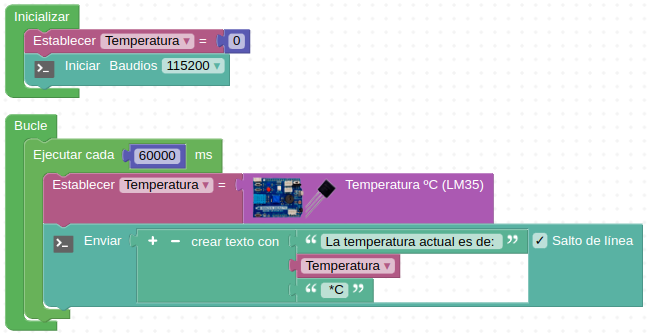

*Actividad-09*

Esto nos generará algo como lo de la imagen siguiente en la consola:

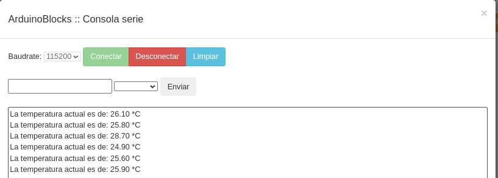

*Consola que produce la actividad 9*

## Retos de ampliación

**A9.R1**. Alarma óptico/acústica por sobrepasar una temperatura de 25ºC. Utilizaremos el zumbador para emitir algún pitido y el LED rojo para la indicación óptica.

**A9.R2**. Semáforo indicador de rangos de temperatura. Se trata de programar un semáforo con un LED RGB que mostrará color verde si la temperatura está por debajo de 25ºC, rojo si está por encima de 35ºC y amarillo si está entre ambos valores.
