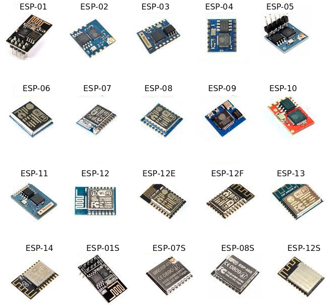
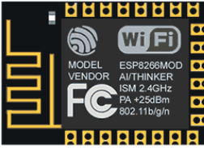
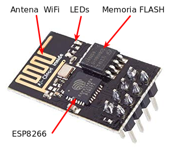
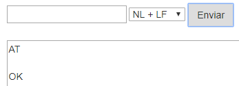
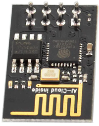

# Teoría básica de IoT

## **1.- ¿Qué es la Internet de las Cosas?**
La expresión “Internet de las cosas” o IoT (del inglés, Internet of Things), internet de todas las cosas o internet en las cosas, hace referencia al uso que hacen de Internet los dispositivos conectados (las cosas) para comunicarse sin intervención humana directa. También se usa el término IoT para referirse al conjunto de estos dispositivos conectados comunicando “entre máquinas” (M2M) sin requerir interacción humana. No existe una Internet especial o diferente para “las cosas”, en principio, se opera con las mismas redes que en otros usos de Internet. En la imagen siguiente se grafica la conexión de elementos con la nube a través de la red.

| Conexión de elementos IoT con la nube |
|:|
|  |

El IoT sirve para monitorización y control electrónico y toma de decisiones inteligente. Es decir, conectar dispositivos a Internet permite enviar y recibir información usando una infraestructura global y así poder monitorizar y/o controlar automáticamente y a distancia multitud de contextos. Por ejemplo, en entornos urbanos (ciudades inteligentes) se puede conocer la actividad humana, del medio ambiente, del tráfico… tanto para informar de su estado (como las plazas de aparcamiento disponibles, la densidad o velocidad de la circulación, la contaminación…) como para tomar decisiones de forma manual o automática para optimizar los recursos disponibles (iluminación, riego de jardines, funcionamiento de los semáforos…)

Para conectar a la red las placas Arduino, sus clones o basadas en el mismo usaremos los módulos ESP8266. El ESP8266 es un chip de bajo costo Wi-Fi que contiene su propio microcontrolador, un Tensilica L106 de 32-bit. Es un chip de bajo bajo coste y reducido tamaño. El chip ESP8266 forma parte de multitud de módulos comerciales a través de diferentes soluciones con distintas funciones, pines, tamaños y precios.

| Modelos ESP |
|:|
|  |

El más simple es el ESP-01, que solo dispone de 2 puertos digitales y necesita un adaptador USB para poder ser programado y es el que vamos a usar aquí. Hay otros muchos sistemas como por ejemplo la placa ESP32 STEAMakers de Keyestudio, ESP-12E de ESP8266, la placa de desarrollo NodeMCU, también basada en el ESP-12E, Además, hay placas con WiFi que usan otros chip WiFi diferentes, como la Arduino MKR1000.

| ESP32 STEAMakers | ESP-12E |
|:|:|
|  |  |
| NodeMCU de Keyestudio | Arduino MKR1000 |
|  | 

## **2.- Módulo ESP8266 ESP-01**

### Introducción
El módulo WiFi ESP-01 es uno de las más populares y económicos, pese a no ser el más potente ni versátil. Actualmente, otros modelos como la ESP-12 o el el ESP32 se están integrando en la mayoría de placas de desarrollo, cobrando un peso e importancia mucho mayor. Sin embargo, nosotros vamos a asociar nuestro pequeño ESP-01 a una placa UNO, con el único fin de darle conectividad WiFi.

El ESP-01 trae instalado una versión de firmware con la que podemos comunicarnos con el ESP8266 mediante comandos AT (veremos a continuación algunos de ellos) a través del puerto serie. Este tipo de comunicación nos va a permitir crear un puente entre la placa TdR STEAM y el ESP8266, consiguiendo así conectar a una red WiFi y dar un primer paso de gigantes en el mundo IoT.

Veamos el aspecto del ESP-01 y algunas de sus características:

| Imagen ESP-01 | Descripción |
|:|---|
|  |  - ESP8266 es el microcontrolador del módulo ESP-01.  - La memoria flash es la BG25Q80A  - Los LEDs informan de si está encendido o no y de la transmisión de datos (Tx y Rx).  - La antena WiFi para la conexión a una internet.  - Los pines permiten conectar alimentación, sensores, …  Toda la información en el [datasheet](https://www.microchip.ua/wireless/esp01.pdf) del fabricante  |

Los pines están distribuidos de la siguiente forma:

| Pines ESP-01 | Descripción | |
|:|---|---|
|  |  1 - GND  2 - Pin digital número 2  3 - Pin digital número 0  4 - RXD es el pin por donde se van a recibir los datos del puerto serie. Trabaja a 3,3 V. También puede ser el pin digital GPIO3   5 - TXD es el pin por donde se van a transmitir los datos del puerto serie. Trabaja a 3,3 V. También puede ser el pin digital GPIO1  | 6 - CH_PD es el pin para apagar y encender el ESP-01: si lo ponemos a 0 V (LOW) se apaga, y a 3,3 V (HIGH) se enciende.  7 - RESET pin a 0V resetea el ESP-01  - Vcc es el pin de alimentación. Funciona a 3,3V y admite un máximo de 3,6 V. La corriente suministrada debe ser mayor que 200 mA.  |

GPIO (del inglés, General Purpose Input Output) son entradas o salidas de propósito general, o sea pines digitales.

El ESP-01 soporta comunicación I2C, por lo que, pese a tener solo un par de GPIOs, podemos conectarle multitud de sensores y actuadores a través del mencionado bus de datos I2C.

### Programación
El ESP-01 dispone de un microcontrolador y una memoria donde poder almacenar programas, luego es un dispositivo programable en si mismo. Cargar programas en el dispositivo es algo mas complejo de lo que hemos visto hasta ahora dado que tiene dos modos de operación, el modo flash o de ejecución y el modo UART o de grabación y debemos ser nosotros quienes activemos un modo u otro, cosa que hasta ahora el entorno ArduinoBlocks ha sido el encargado de hacerlo. Los modos de operación se configuran a través de los puertos GPIO0 y GPIO2.

Para programar el ESP-01 hay que usar los pines Rx y Tx para transmitir los datos a la memoria Flash, donde se almacenará el sketch o programa.

En las placas de control los pines Rx y Tx están en los pines D0 y D1 respectivamente y también son los que se utilizan para cargar programas a una velocidad de 115200 baudios, así que si estos pines los ocupamos con el ESP8266 no podremos cargar programas en nuestra placa. Ahora bien, es posible utilizar otros pines para usar WiFi y evitar este problema, pero el resto de pines digitales solamente trabajan a 9600 baudios y el ESP-01 por defecto viene a 115200, luego para utilizarlo en pines distintos a los D0 y D1 de la placa tendremos que reprogramarlo para que la velocidad sea de 9600 baudios.

Aunque sea bastante técnico debemos exponer cómo configurar los dos modos de funcionamiento de forma breve.

* **Modo de funcionamiento UART**. Para cargar un programa en el ESP-01 debemos o bien encenderlo o bien resetearlo pero teniendo los siguientes estados de pines:GPIO0 = 0 (nivel bajo o LOW = 0 V).

  - GPIO2 = 1 (nivel alto o HIGH = 3,3 V = Vcc).
  - Recordemos siempre que el ESP8266 trabaja con niveles lógicos de 3,3 V.

El pin GPIO2 está por defecto a HIGH, ya que tiene un pull-up interno, por lo que podemos dejarlo simplemente desconectado.

* **Modo de funcionamiento Flash**. Para ejecutar un programa en el ESP-01 una vez cargado debemos tener la siguiente configuración de pines:

  - GPIO0 = 1
  - GPIO2 = 1

Tanto el GPIO0 como el GPIO2 están por defecto a HIGH, ya que ambos tienen un pull-up interno, por lo que podemos dejarlos simplemente desconectados.

En este momento reflexionamos sobre el uso de Rx y Tx ya que si los estamos utilizando para cargar el programa en la placa y GPIO0 y GPIO2 para indicar el modo de trabajo ¿cómo conectamos los sensores y actuadores al ESP-01?. Veamos:

1. Rx y Tx los utilizamos para cargar el programa. Una vez finalizada la carga los podemos utilizar como pines de entrada y salida digitales. 
2. Los modos de trabajo se indican cuando se resetea o reinicia la placa. Una vez que tengamos el modo de ejecución podemos conectar cualquier componente a estos pines.

Los programas los podemos subir a nuestro ESP-01 mediante el IDE de Arduino o por medio de un convertidor USB-serie igual o similar al de la imagen siguiente:

| conversor USB-serial |
|:|
|  |

Se trata de un escudo o shield para el módulo WiFi ESP-01 que está provisto de un chip conversor de USB a puerto serie, en concActividad el CH340G. El proceso de reprogramación con esta placa es bastante sencillo pero requiere de comando AT que pasamos a introducir antes de continuar.

## **3.- Comando AT en el ESP8266**
El ESP-01 viene por defecto con el firmware AT ai-thinker V0.9.2.4. Los módems venían con un conjunto de comandos que permiten que nos podamos comunicar con ellos para configurarlos y que lo podamos hacer a través del puerto serie de ordenador al que están conectados. A estos comandos se les llama AT (de attention).

Después de cada comando AT, el ESP8266 espera los caracteres especiales de nueva linea <CR><LF> para ejecutar el comando. El carácter no imprimible CR (del inglés, Carriage Return) significa Actividadrno de carro y LF ( del inglés, Line Feed) es salto de línea. El origen de la nomenclatura está en las máquinas de escribir.

En el enlace tenemos un pdf de la empresa [Espressif Systems](https://www.espressif.com/sites/default/files/documentation/4a-esp8266_at_instruction_set_en.pdf) con el juego de comandos AT para el ESP8266.

En la tabla siguiente damos un resumen de los comandos con una información ampliada de los que vamos a usar para la configuración inicial que necesitamos.

| Unos comandos AT |
|:|
|  |

## **4.- Preparación del módulo ESP-01**
Primero conectamos el módulo ESP8266 a la shield USB-serie y este a su vez a un puerto USB de nuestro ordenador. Nos aseguramos de que el interruptor está en modo Flash Boot.

Entramos en ArduinoBlocks con ArduinoBlocks-Connector en funcionamiento, realizamos un refresco de la lectura del puerto para que detecte a la shield del módulo WiFi si es necesario, abrimos la consola, escogeremos la opción de 115200 en baudrate y también la de NL + LF (NL + LF es igual que CR + LF) para comunicarnos con el módulo WiFi. Hacemos clic en Conectar y conectamos la consola, escribimos “AT” en ella y clic en enviar. La situación es la de la imagen siguiente:

| Comando AT en consola AB |
|:|
|  |

Si todo es correcto debe respondernos “OK”. Si responde algo sin sentido o no contesta, significa que está configurado en alguna otra velocidad. En este segundo caso deberemos cambiar la opción de baudrate y repetir la operación con diferentes velocidades hasta que nos responda “OK”. La situación correcta en la consola de comandos es la siguiente:

| Respuesta al comando AT |
|:|
|  |

Una vez que nos responda “OK”, le enviamos el texto “AT+UART_DEF=9600,8,1,0,0” y nos debe responder otra vez “OK”.

| Comando AT para establecer velocidad a 9600 baudios |
|:|
|  |

Con esto hemos cambiado la velocidad a 9600 baudios mediante el comando AT+UART_DEF que nos permite cambiar la definición a 9600 baudios, con 8 bits de datos, 1 bit de parada, sin paridad y sin habilitar el control de flujo.

Una vez que hemos configurado el módulo WiFi a la velocidad que nos interesa debemos crear un canal en un servidor MQTT donde enviar los datos y visualizarlos. Esto lo vamos a hacer a través de la web de [Thingspeak](https://thingspeak.com/), pero antes de nada vamos a describir que es MQTT.

Para saber mas acerca de la reprogramación de la velocidad de comunicación con ESP8266 visita el enlace: [Reprogramar la velocidad de comunicación del ESP8266](http://arduinoblocks.didactronica.com/2019/02/reprogramacion-del-modulo-esp-01-para/).

## **5.- Una introducción al IoT a través de MQTT**
Si queremos trabajar en tareas de IoT debemos de utilizar algún protocolo de comunicación y hoy por hoy el principal es MQTT, pero antes de citar protocolos vamos a tratar algunos conceptos necesarios. Un protocolo de comunicación no es otra cosa que una serie de normas definidas para que dos o más dispositivos puedan comunicarse entre si de forma comprensible para ambos.

* **Requisitos del IoT**

Estamos bastante acostumbrados a realizar un tipo de comunicación denominada M2M (machine-to-machine) utilizando internet, pero cuando trabajamos en IoT debemos establecer una serie de requisitos que hacen que la comunicación M2M no sea la mas adecuada. Algunos de estos requisitos son:

- Cantidad: se puede llegar a tener un gran número de dispositivos diferentes, desde sensores, actuadores, servidores, etc.
- Escalabilidad: los sistemas deben permitir añadir o eliminar dispositivos sin que el sistema global resulte afectado.
- Variedad: normalmente necesitaremos que el sistema funcione con diferentes sistemas operativos, lenguajes de programación y el mayor número posible de dispositivos.
- Simultaneidad: gran cantidad de comunicaciones simultaneas, lo que requiere respuestas rápidas para lo que es necesario que los mensajes transmitidos sean lo mas cortos posibles.
- Seguridad: internet no es un sitio muy seguro y estos dispositivos van a estar conectados a internet controlando dispositivos físicos.
- Accesibilidad: tendremos que trabajar en condiciones muy variadas en lo que se refiere a ancho de banda, firewall, direccionamiento,…

La solución mas común consiste en disponer un servidor denominado ‘broker’, o a veces ‘Router’, que será el que reciba los mensajes de los dispositivos emisores y los distribuirá a los receptores.

| Broker |
|:|
|  |

El broker va a tener una dirección IP fija y será accesible para todos los dispositivos, puede mantener un registro de los dispositivos conectados, recibir y distribuir mensajes y establecer filtros de destinatarios. Esto permite algo fundamental, y es que cada dispositivo no dependa del resto de dispositivos.

Veamos algunos conceptos que nos permitan entender las infraestructuras de los servicios IoT:

- Message Queue o cola de mensajes. En este tipo el broker genera una cola de mensajes única para cada uno de los clientes que inician la suscripción.
- Message Service o servicio de mensajería. En este tipo el broker distribuye inmediatamente los mensajes filtrados por algún criterio a los clientes conectados. A diferencia de Message Queue, los mensajes entregados mientras el cliente está desconectado se pierden. 
- Publish/Susbcribe (PubSub). Se trata de un sistema de mensajería donde el 'Subscriber' informa al broker de que quiere recibir un tipo de mensajes y el 'Publisher' entonces puede publicarlos. 
- Router Remoder Procedure Calls (RRPC). Se trata de la ejecución remota de procedimientos donde 'Callee' comunica al broker que proporciona un procedimiento y el 'Caller', puede llamar a este procedimiento.

Algunos de los protocolos para IoT son:

- MQTT (del inglés Message Queuing Telemetry Transport) es un protocolo PubSub de servicio de mensajería que actúa sobre TCP. Es ligero y fácil de implementar resultando apropiado para dispositivos de baja potencia, tan habituales en IoT. TCP es un protocolo de control de transmisión (del inglés, Transmission Control Protocol) fundamental en Internet.
- AMQP (Advanced Message Queuing Protocol) es un protocolo PubSub de cola de mensajes que asegura la confiabilidad e interoperabilidad necesaria en aplicaciones corporativas.
- STOMP (Streaming Text Oriented Messaging Protocol). Es un protocolo sencillo que emplea HTTP y mensajes de texto.
- XMPP (Extensible Messaging and Presence Protocol). Es un protocolo abierto basado en XML diseñado para aplicaciones de mensajería instantánea.
- WAMP (Web Application Messaging Protocol). Es un protocolo abierto que se ejecuta sobre WebSockets, y provee tanto aplicaciones de PubSub como RRPC.
- CoAP (Constrained Application Protocol) es un protocolo pensado para emplearse en dispositivos de IoT de baja capacidad.

* **MQTT**

Dentro de una arquitectura de MQTT, es muy importante el concepto topic (tema en español) ya que la comunicación se realiza a través de topics debiendo estar los emisores y receptores subscritos a un topic común para poder establecer la comunicación. Este tipo de arquitectura permite que la comunicación pueda ser de uno a uno o de uno a muchos.

Los topics tienen estructura jerárquica pudiendo establecer relaciones padre-hijo de manera que cuando nos suscribimos a un topic padre podemos recibir también la información de sus hijos. En un ejemplo lo podemos ver más claramente.

| Estructura jerarquica de un topic |
|:|
|  |

Un topic se representa mediante una cadena con las jerarquias separadas por /. Por ejemplo:

- Vivienda/Planta baja/Cocina/Arduino/Luz
- Vivienda/Planta alta/Dorm.1/Arduino/Temperatura.

De esta forma podemos suscribirnos a un topic concActividad o a varios, por ejemplo:

- Un topic: Vivienda/Planta baja/Cocina/Arduino/Luz
- Varios topics: Vivienda/Planta baja/#

Existen básicamente tres tipos de brokers, los privados, los públicos y los locales. A continuación citamos alguno de los más utilizados:

**a**.- Private MQTT Broker: solamente los dispositivos que establezcamos pueden publicar o suscribirse a un topic. Se utiliza en producción y prototipado. Algunos de ellos son:

- [Azure](https://docs.microsoft.com/en-us/azure/iot-hub/iot-hub-mqtt-support) de Microsoft.
- [AWS](https://docs.aws.amazon.com/iot/latest/developerguide/mqtt.html) de Amazon.
- [CloudMQTT](https://www.cloudmqtt.com/plans.html) disponible en: [https://www.cloudmqtt.com/plans.html](https://www.cloudmqtt.com/plans.html).
- [ThingSpeak](https://thingspeak.com/login?skipSSOCheck=true) de [Mathworks](https://es.mathworks.com/) (MATLAB).

**b**.- Public MQTT Broker: cualquier dispositivo puede publicar y suscribirse a topics. Algunos de ellos son:

- [Eclipse](https://iot.eclipse.org/)
- [Mosquitto](http://test.mosquitto.org/)
- HiveMQ: [Enlace](https://www.hivemq.com/downloads/) - [Dirección del broker](http://www.mqtt-dashboard.com/)
- [Flespi](https://flespi.com/mqtt-broker)
- [Dioty](http://www.dioty.co/)
- [Fluux](https://fluux.io/)
- [Thingspeak](https://thingspeak.com/login?skipSSOCheck=true)

Si queremos instalar nuestro propio broker en una raspberry o PC, sin duda [Mosquito](http://test.mosquitto.org/) es la opción más extendida.

## **6.- Creación de un canal en un servidor MQTT**

En nuestro caso vamos a utilizar Thingspeak en su versión pública. Lo primero que debemos hacer es crear una cuenta, para lo que clicamos en Sign Up. Seguidamente, introducimos un correo electrónico válido y el resto de datos que nos pide. Lo vemos en la imagen siguiente:

| Pagina inicial de Thingspeaks |
|:|
|  |

Debemos aceptar que use la dirección de correo electrónico para nuestra cuenta de MathWorks, como se ve en la imagen siguiente:

| Aceptación a Mathwork |
|:|
|  |

Tras esto recibiremos un correo en la dirección que hemos dado para confirmar la creación de la cuenta y confirmarla. Debemos ver algo similar a la imagen siguiente:

| Confirmacion aceptación cuenta correo |
|:|
|  |

Una vez confirmada la dirección de correo electrónico, volvemos a la página donde estábamos y hacemos click en continuar. Nos pedirá un nombre de usuario y una contraseña que usaremos a partir de ahora para iniciar sesión.

Finalizada la creación de la cuenta iniciamos sesión desde la página principal haciendo clic en “Sign In”. Veremos una ventana como la de la imagen siguiente:

| Ventana para identificación en Thingspeaks |
|:|
|  |

Escribimos nuestra contraseña y hacemos clic en el botón Sign in.

| Acceso a Thingspeaks |
|:|
|  |

Con esto entramos en el broker y está todo listo para iniciar el trabajo.

| Acceso correcto al broker |
|:|
|  |

Podemos aprender mas sobre el tema visitando los siguientes enlaces:

- [Primeros pasos con Wifi: Servidor sin clave y contraseña](https://www.youtube.com/watch?v=p9Fn7AEJJjo)
- [Wifi con servidor gratuito con clave y contraseña y app móvil](https://youtu.be/AvXWOroK8BI)
- [Cómo publicar y almacenar datos por Wifi en Internet con Thingspeak](https://didactronica.com/como-publicar-y-almacena-datos-por-wifi-en-internet/)

## **7.- Filtrado por MAC**
Si por cualquier motivo nuestra red WiFi tiene filtrado MAC debemos de dar de alta en la misma de nuestro dispositivo ESP-01. Esta es una tarea que va a depender de nuestro router y suministrador y que no resulta especialmente complicada. Lo primero que debemos hacer es averiguar la dirección MAC de nuestro dispositivo ESP8266. Esta tarea no la vamos a hacer desde ArduinoBlocks sino que vamos a recurrir al IDE de Arduino.

Si necesitas ayuda para este tema seguro que la encuentras en estos [tutoriales de Luis Llamas](https://www.luisllamas.es/tutoriales-de-arduino/), o también puedes buscar información en tu navegador pues existen multitud de páginas referentes al tema de programación desde el IDE de Arduino.

Los elementos que vamos a utilizar para conectar nuestro módulo ESP-01 a la placa TdR STEAM los vemos en la imagen siguiente:

| Shield WiFi serial | Módulo ESP-01 |Conector de comunicaciones en la TdR STEAM | Cables tipo Dupont M-H |
|:|:|:|:|
|  |  |  |  |

* **Conexionado**
Nos encontramos con el problema de que el orden de pines en el conector de la TdR STEAM (RX-TX-GND-VCC) no coinicede con el de la Shield WiFi serial (RX-TX-VCC-GND) por lo que no lo vamos a poder "pinchar" directamente en el conector y debemos utilizar cables tipo Dupont.

Debemos tener muy presente que la placa  **TdR STEAM ya realiza una conexión cruzada entre los pines Tx y Rx**, es decir:

- Rx de la TdR STEAM va conectada a Tx de la placa UNO
- Tx de la TdR STEAM va conectada a Rx de la placa UNO

En la imagen siguiente vemos gráficamente como debemos hacer el conexionado al que nos estamos refiriendo.

| Conexión NO CRUZADA TdR - Shield |
|:|
|  |

Para nuestro propósito de comunicar el ordenador con el ESP-01 a través del IDE y averiguar la MAC de nuestro dispositivo creo que lo mas conveniente y claro es realizar el montaje que vemos en la imagen siguiente:

| Conexión cruzada UNO a Shield wifi |
|:|
|  |

En este caso si es totalmente imprescindible realizar la conexión cruzada mostrada en la imagen entre Tx y Rx.

* **Comunicación entre PC y ESP01**

Con la conexión cruzada descrita y un sketch vacío en el IDE que subimos a la placa UNO, conectamos el UNO al ordenador y establecemos la configuración de nuestra placa UNO y el puerto USB al que estamos conectados. Lo que en realidad hacemos es usar la placa UNO como un convertidor bidireccional USB a RS232 que nos permite comunicar el ordenador con la placa ESP8266 ESP01. Abrimos el monitor serie desde el IDE de Arduino y lo configuramos como vemos en la imagen siguiente:

| Configuración del monitor serie |
|:|
|  |

Escribimos AT y pulsamos Enter o hacemos clic en Enviar y el módulo deberá responder OK si todo es correcto. Si la velocidad por defecto del módulo no es de 115200 no responderá y posiblemente se vean caracteres extraños en el monitor serie. En este caso habrá que probar distintas velocidades hasta conseguir que el módulo responda OK al comando AT. El resultado correcto lo vemos en la imagen siguiente:

| Comando AT OK |
|:|
|  |

* **Dirección MAC**

El último paso es teclear el comando AT para conseguir la dirección física o MAC del dispositivo conectado. Este comando es **AT+CIFSR** y es que el que vemos en la imagen siguiente:

| Comando AT para obtener la MAC |
|:|
|  |

El comando AT+CIFSR nos devuelve un resultado similar al que vemos en la imagen siguiente:

| MAC obtenida |
|:|
|  |

Ya podemos dar de alta la MAC del dispositivo en nuestro filtrado MAC y poder así comunicarnos a través de WiFi.
