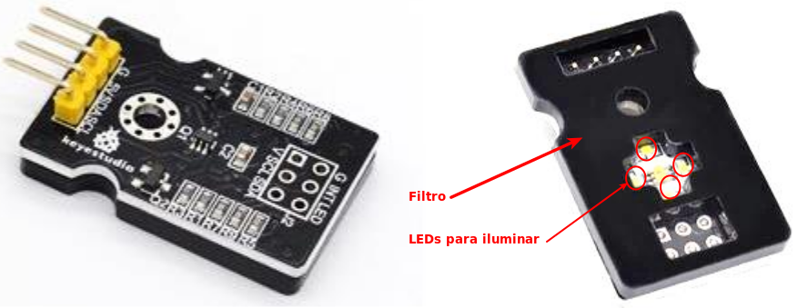
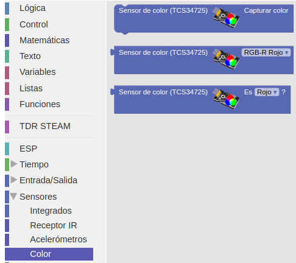
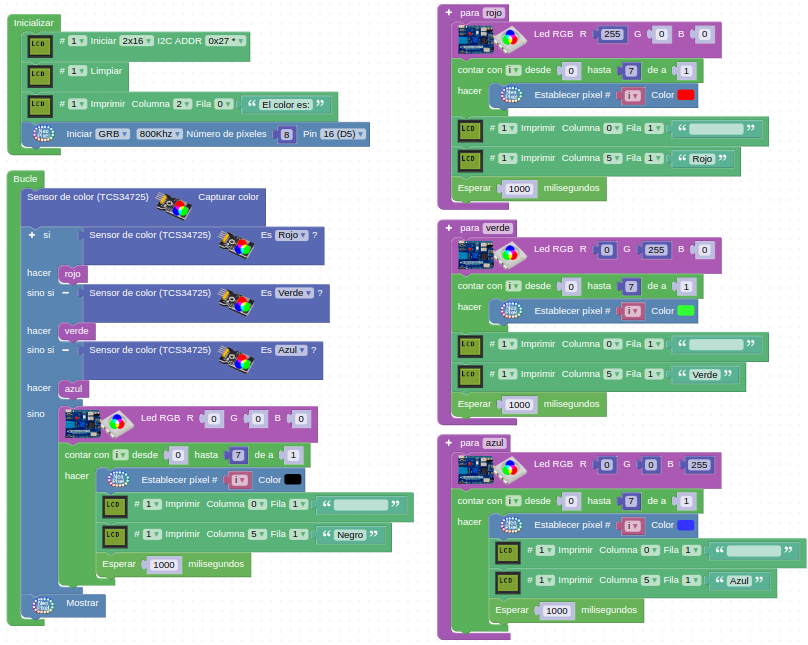

# Sensor de color

## Enunciado
A partir de una tarjeta en la que se han dispuesto tres zonas de colores rojo, verde y azul haremos que cuando acerquemos el sensor a alguna de ellas la tira de LEDs RGB se ilumine en ese color permaneciendo apagado si no detecta ninguno de los tres colores.

## Teoría
El sensor de color RGB TCS34725 puede reconocer el color de la superficie de un objeto a través de la detección óptica. El sensor se ilumina con luz brillante y emite los valores RGB correspondientes. Además, para evitar la interferencia del entorno y aumentar la precisión, dispone de una placa protectora de luz infrarroja en la parte inferior del sensor, de modo que el elemento de espectro infrarrojo de la luz incidente se minimiza para hacer que la gestión del color sea más precisa. En la parte inferior del sensor, se pueden ver 4 LEDs que garantizan que el sensor se pueda usar normalmente en condiciones de poca luz ambiental. En la figura siguiente vemos el aspecto del mismo por ambos lados.

*Aspecto*

Estas son sus especificaciones técnicas:

* Voltaje de funcionamiento: 3.3-5V
* Corriente de funcionamiento: 65uA
* Distancia medida: 3-10mm
* Frecuencia de reloj: 0-400KHZ
* Interfaz: I2C y paso de pin de 2,54 mm
* Rango de temperatura: -30 °C ~ + 70

El sensor se comunica con la placa ESP32 Plus STEAMakers a través del bus de comunicaciones I2C. No necesitaremos asignarle dirección física porque ya vienen predefinido dentro del propio bloque. Dentro del apartado 'Sensores' tenemos los bloques para trabajar con este sensor. En la figura siguiente podemos ver los bloques para programar el sensor de color.

*Bloques*

## Programando la actividad
Hacer un programa que cumpla las condiciones del enunciado y que además encienda el LED RGB de la TdR STEAM y muestre el nombre del color en la LCD. El programa de la imagen siguiente esta disponible como [detectar-color](./programas/detectar-color.abp).

*Encender la tira del color detectado*

