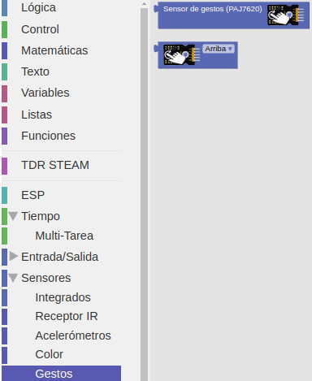

# Sensor de gestos

## Enunciado
A partir de una tarjeta en la que se han dispuesto tres zonas de colores rojo, verde y azul haremos que cuando acerquemos el sensor a alguna de ellas la tira de LEDs RGB se ilumine en ese color permaneciendo apagado si no detecta ninguno de los tres colores.

## Teoría
El módulo sensor de reconocimiento de gestos se basa en el chip PAJ7620 que integra el reconocimiento de gestos a partir de una cámara diminuta y se comunica utilizando la interfaz I2C.

Este sensor de gestos puede reconocer los nueve gestos embebidos en sus registros y que son:

1. Moverse hacia arriba
2. Moverse hacia abajo
3. Moverse hacia la izquierda
4. Moverse hacia la derecha
5. Moverse hacia adelante
6. Moverse hacia atrás
7. Moverse en sentido horario
8. Moverse en sentido antihorario
9. Moverse en forma de onda.

El rango normal de detección está comprendido entre 5 y 15 cm con una velocidad del gesto de entre 60 y 600 º/s (grados por segundo)

Estas son sus especificaciones técnicas:

* Tensión de trabajo: DC 5 V
* Corriente de trabajo: 50mA
* Potencia máxima: 0.5 W
* Distancia de detección: 10 cm
* Velocidad de gestos: 60 °/s a 600 °/s
* Inmunidad a la luz ambiental: <100k Lux
* Velocidad de comunicación I2C: 400 kbit/s
* Temperatura de trabajo: -25 a + 65 °C

En la figura siguiente vemos su aspecto.

*Aspecto*

 La figura anterior muestra la posición correcta del sensor para reconocer los gestos implementados en los bloques 

En la figura siguiente podemos ver los bloques para programar el sensor de gestos.

*Bloques*

La forma de trabajar con el sensor es primero leer el gesto y luego determinar que gesto estamos haciendo. El bloque de la figura siguiente nos permite elegir entre los nueve gestos posibles.

*Bloque tipos de gestos*

## Programando la actividad
En esta ocasión vamos a realizar dos prácticas, una básica y otra mas avanzada para así trabajar con el sensor.

* **Actividad básica**

Mostrar por consola el movimiento realizado en forma de número entero por la consola. El programa de la imagen siguiente esta disponible como [gesto-consola](./programas/gesto-consola.abp).

*Mostrar gesto por consola*

* **Actividad avanzada**

Vamos a enceder y apagar los diodos LEDs rojo y azul de la TdR STEAM respondiendo a los siguientes gestos:

- Encender LED rojo: Arriba
- Apagar LED rojo: Abajo
- Encender LED azul: Izquierda
- Apagar LED azul: Derecha

El programa de la imagen siguiente esta disponible como [gesto-LEDs](./programas/gesto-LEDs.abp).

*Encender y apagar LEDs por gestos*

## Retos de ampliación

**Gestos.R1**. Realiza un programa que en función de cada uno de los nueves movimientos posibles encienda el led RGB de la TdR STEAM con un color diferente.

**Gestos.R2**. Amplia el programa para que se encienda del mismo color (o diferente) los LEDs de la tira.
