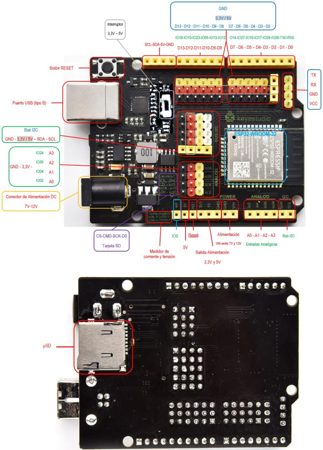

# ESP32 Plus STEAMakers
La placa ESP32 Plus STEAMakers nos ofrece una gran cantidad de prestaciones al estar basada en un microcontrolador de 32 bits con conectividad WiFi y Bluetooth integradas en la propia placa y también un zócalo para tarjetas µSD para el almacenamiento de datos. También dispone de conexiones para todas las entradas y salidas con posibilidad de tener la alimentación adjunta y puertos de expansión I2C para poder conectar diferentes dispositivos directamente en la placa. En la figura siguiente vemos su aspecto.

*Aspecto de la placa ESP32 Plus STEAMakers*

La placa está basada en el microcontrolador ESP32-WROOM-32 y sus principales especificaciones técnicas son:

* Microcontrolador Tensilica Xtensa 32-bit LX6 a 160MHz.
* Conectividad WiFi 802.11 b/g/n/e/i.
* Conectividad Bluetooth 4.2 y modo BLE.
* Zócalo para tarjetas µSD.
* 14 entradas y salidas digitales con alimentación.
* Conector serie hembra con alimentación.
* Conector I2C para conectar hasta 5 dispositivos a la vez sobre la misma placa.
* Conector hembra I2C para conexión de una pantalla OLED.
* Botón de Reset.
* Conector de 5V
* Conector de 3.3V
* Interruptor 3.3-5V para cambiar entre estas dos tensiones en algunos pines de alimentación.
* Entradas y salidas analógicas.
* Sensor Hall y de temperatura integrado.
* 2 convertidores Digital-Analógico (DAC) de 8 bits.
* 16 convertidores Analógico-Digital (ADC) de 12 bits.
* 16 canales PWM.
* 2 UART.
* 2 canales I2C.
* 4 canales SPI.
* 448Kb ROM.
* 520 KB SRAM.
* 8KB+8KB SRAM en RTC.
* 1kbit eFUSE.
* 512 bytes Memoria Flash (EEPROM).
* 10 sensores táctiles.
* 4 temporizadores internos de 64 bits.

No están disponibles todas las características del controlador ESP-WROOM-32, ya que algunos pines tienen funciones dobles y se utilizan en la placa de forma específica (como, por ejemplo, para controlar la tarjeta SD). Pero la mayoría de funciones se pueden utilizar, además de disponer la placa ESP32 Plus STEAMakers de una mejor conexión de elementos debido a los pines para conectores tipo Dupont de entrada y salida, de I2C y de alimentación. Además, algunos pines de alimentación pueden cambiar su valor (3,3V o 5V) mediante un interruptor en función de nuestras necesidades.

En la figura siguiente vemos un momento del [video descriptivo de la placa ESP32 STEAMakers](https://www.youtube.com/watch?v=MQjIEI7I4ik&list=PL1pKD-Bz2QBAgfy580m8OaQ2Z60v6DOhC) que se aloja en el [canal Youtube de ArduinoBlocks](https://www.youtube.com/c/ArduinoBlocks).

*Comparativa de la ESP32 STEAMakers*

A continuación vemos una imagen en la que se compara el potencial de la placa ESP32 Plus STEAMakers
En la figura siguiente vemos los elementos que componen la placa ESP32 Plus STEAMakers:

*Elementos en la placa ESP32 Plus STEAMakers*

## Relación conexiones tipo UNO
Las conexiones de la placa Imagina TDR STEAM con la placa ESP32 Plus STEAMakers son las mismas que si utilizamos cualquier placa compatible con Arduino UNO. En la tabla siguiente se establece la relación entre los elementos de la placa Imagina TdR STEAM y las conexiones de una placa ESP32 Plus STEAMakers.

| Pin UNO | Uso en TdR STEAM | Descripción |
|:|---|---|
| D0 | Rx | Pin de recepción Bluetooth y WiFi |
| D1 | Tx | Pin de transmisión Bluetooth y WiFi |
| D2 | Pulsador SW1 | Entrada digital |
| D3 | Conector para entrada/salida digital externa | Entrada/salida digital |
| D4 | Sensor de Temperatura y Humedad DHT11 | Entrada digital |
| D5 | Conector para entrada/salida digital externa | Entrada/salida digital |
| D6 | Color rojo del LED RGB | Salida digital |
| D7 | Pulsador SW2 | Entrada digital |
| D8 | Zumbador o buzzer | Salida digital |
| D9 | Color verde del LED RGB | Salida digital |
| D10 | Color azul del LED RGB | Salida digital |
| D11 | Sensor IR | Entrada digital |
| D12 | LED rojo | Salida digital |
| D13 | LED azul | Salida digital |
| A0 | Potenciómetro | Entrada analógica |
| A1 | Sensor de luz (LDR) | Entrada analógica |
| A2 | Sensor de temperatura (LM35) | Entrada analógica |
| A3 | Conector para entrada analógica externa | Entrada analógica |
| A4 | SDA (Serial DAta.) | Datos I2C |
| A5 | SCL (Serial CLock) | Señal de reloj I2C |

## Compatibilidad y descripción de pines ESP32 STEAMakers
**Importante**: Todos los pines IOxx son entradas y salidas digitales, algunas con más funciones. Utilizando la comunicación WiFi no funciona el ADC2.

En la tabla siguiente tenemos relacionados todos los pines entre los tipos de placas UNO, Imagina TdR STEAM y ESP32 STEAMakers.

| UNO | TdR STEAM | ESP32 |||
|:|---|---|---|---|
| Pin | Función | Pin | Función | Ampliación |
| D0 | Rx | IO03 | Rx | UART 0 RX |
| D1 | Tx | IO01 | Tx | UART 0 TX |
| D2 | Pulsador SW1 | IO26 | ADC2 CH9 | DAC2 |
| D3 | Libre | IO25 | ADC2 CH8 | DAC1 |
| D4 | DHT11 | IO17 | | UART 2 TX |
| D5 | Libre | IO16 | | UART 2 RX |
| D6 | Color rojo del LED RGB | IO27 | ADC2 CH7 | ADC2-7 / TOUCH7 |
| D7 | Pulsador SW2 | IO14 | ADC2 CH6 | ADC2-6 / TOUCH6 |
| D8 | Zumbador o buzzer | IO12 | ADC2 CH5 | ADC2-5 / TOUCH5 |
| D9 | Color verde del LED RGB | IO13 | ADC2 CH4 | ADC2-4 / TOUCH4 |
| D10 | Color azul del LED RGB | IO05 | | VSPI CSO |
| D11 | Sensor IR | IO23 | |  VSPI MOSI |
| D12 | LED rojo | IO19 | |  VSPI MISO |
| D13 | LED azul | IO18 | |  VSPI CLK |
| GND |  | GND |  | |
| AREF | | Reset | |
| SDA | I2C | IO21 | |
| SCL | I2C | IO22 | |
| A0 | Potenciómetro | IO02 | ADC2 CH2 | |
| A1 | Sensor de luz (LDR) | IO04 | ADC2 CH0 | |
| A2 | Sensor de temperatura (LM35) |IO36 | ADC1 CH0 | |
| A3 | Libre | IO34 | ADC1 CH6 | |
| A4 | I2C | IO38 | | |
| A5 | I2C | IO39 | ADC1 CH3 | |
| VIN | | VIN | |
| GND |  | GND |  | |
| GND |  | GND |  | |
| 5V |  | 5V |  | |
| 3.3V |  | 3.3V | | |
| RST | | Reset | | |
| 5V |  | 5V |  | |
| | | IO00 | ¡ No conectar ! | |
| - | | IO32 | D0 - uSD | |
| - | | IO15 | CLK - uSD | |
| - | | IO33 | CMD - uSD | |
| - | | IO35 | IOUT | Medidor de corriente |
| - | | IO37 | VOUT |  Medidor de tensión |

