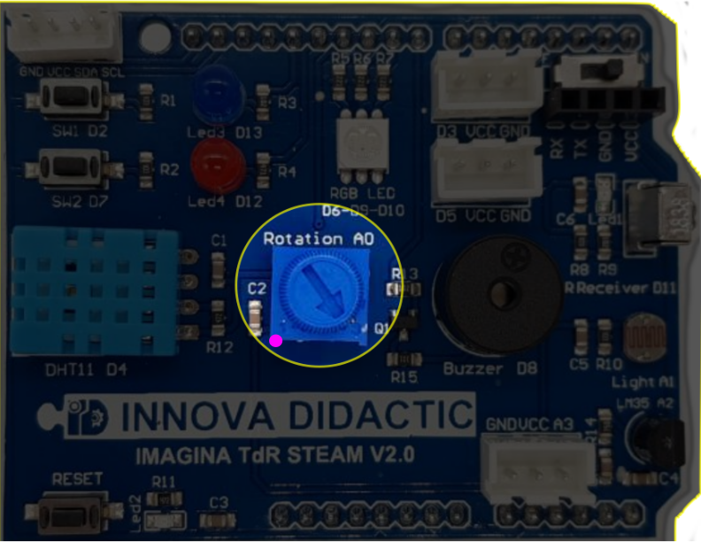

# Información muy importante

## Potenciómetro
Como también se indicará cuando hablemos específicamente de potenciómetro, es muy importante que el mismo esté totalmente girado a la izquierda como está marcado en la imagen siguiente con el punto de color.

*El potenciometro de la TdR STEAM*

El motivo es que el potenciómetro comparte la conexión A0 (GPIO02) con el sistema de grabación del programa y si el mismo no está en su posición de cero resistencia se producirá un error en el envío del programa a la placa porque se entenderá que los pines de transmisión están ocupados con otra tarea.

## Connector
También es muy importante que el **Connector** esté abierto siempre. Se sugiere acostumbrarse a seguir la siguiente secuencia de conexiones:

1. Conectar la placa ESP32 Plus STEAMakers al puerto USB del ordenador.
2. Poner en ejecución ArduinoBlocks Connector.
3. Loguearse en ArduinoBlocks y aparecerá el puerto asignado, como vemos en la figura siguiente.

*Puerto asignado*

## Sensores integrados. Energía

La placa ESP32 Plus STEAMakers se basa en el microcontrolador ESP32-WROOM-32 que dispone de dos sensores internos. Se trata de un sensor de efecto hall y un sensor de temperatura. Con el sensor de efecto hall detectamos campos magnéticos en la proximidad de la placa y con el de temperatura podemos medir y controlar la temperatura a la que se encuentra el procesador de la placa.

La placa ESP32 Plus STEAMakers lleva implementado un medidor de tensión e intensidad con el que podemos saber la tensión de alimentación en todo momento. Si la tensión de alimentación baja
de aproximadamente 4,8V la placa no funcionará correctamente (sobre todo la transmisión WiFi). Es recomendable realizar una verificación de la tensión que está entregando el puerto USB del ordenador. Si la tensión no es próxima a 5V deberemos cambiar el cable USB, alimentar el puerto USB de forma externa o alimentar la placa con una fuente de alimentación. Es decir, dispone de un sistema para poder medir el consumo de energía.

Los bloques para trabajar con estos sensores están en 'Sensores`, entrada 'Integrados', y son los que vemos en la figura siguiente:

*Sensores integrados*

## WiFi
También hay que tener en cuenta que cuando utilizamos la comunicación mediante WiFi deja de funcionar el ADC2, por lo que en la placa Imagina TDR STEAM no funcionarán ni el potenciómetro (A0) ni la LDR (A1).

## Actividades

### A1. Leer valor de tensión de alimentación

Un programa para verificar la tensión de alimentación de la placa ESP32 Plus STEAMakers lo vemos en la figura siguiente:

*Medir la tensión de alimentación*

Que nos arroja un resultado en la consola como el que vemos en la figura siguiente:

*Consola del programa medir la tensión de alimentación*

### A.2. Graficar todos los parámetros del 'Medidor de energía'

El programa [SP-medidor-energia](./programas/SP-medidor-energia.abp) de la figura siguiente realiza la captura en variables de los cuatro parámetros disponibles y los envía al Serial Plotter. Para modificar el valor de los mismos se han creado las funciones encender y apagar que encienden y apagan los diodos LEDs de la TdR STEAM y de la tira de 8 lEDs.

*Programa Serial Plotter*

En la figura siguiente vemos el resultado de forma gráfica.

*Serial Plotter*

### A.3. Sensores internos
Un programa como el de la figura siguiente nos va a mostrar por consola los valores leídos por los sensores internos.

*Sensores internos*

El resultado en consola lo vemos en la figura siguiente:

*Consola sensores internos*

## Retos

* **R1**. Realizar la actividad A2 mostrando los datos por consola.
* **R2**. Realizar la actividad A2 mostrando los datos en la LCD.
* **R3**. Hacer una captura de datos en formato CSV de alguno de los parámetros del 'Medidor de energía'.
