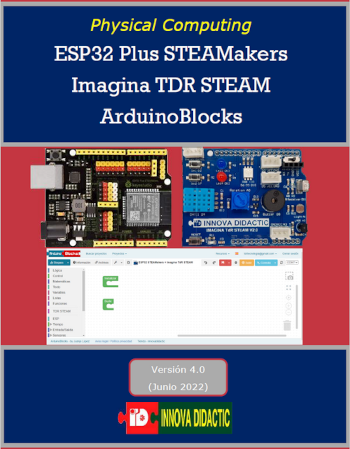
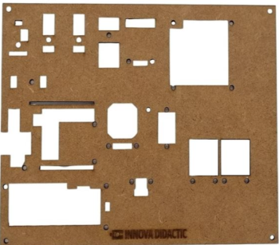
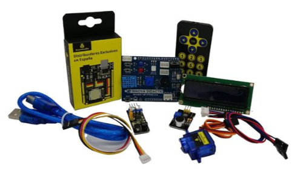

# Notas sobre ESP32 STEAMakers
Estas notas se dedican a la programación de la placa de control ESP32 Plus STEAMakers por si misma o junto con la shield Imagina TDR STEAM y otros equipamientos y todo con ArduinoBlocks.

El kit base esta formado por la placa ESP32 STEAMakers con la shield TDR STEAM colocada encima.

Recuerda que tenemos un tutorial, que vamos actualizando, de estas dos placas. También encontrarás cómo utilizar y conectar muchos otros sensores. En [Miscelanea](Miscelanea/webgrafia.md) puedes acceder al mismo.

*Portada del manual*

## **Documentación y software ESP32 STEAMakers**
Aquí tenéis un enlace a un documento de Robolot.org con la [documentación de la placa ESP32 STEAMakers y el software asociado](https://campus.innovadidactic.com/mod/url/view.php?id=709).

Lo mas conveniente es descargar el archivo, que está en formato zip, y descomprimirlo en un directorio local para poder trabajar con este material.

## **El kit**
En el [archivo pdf](Manuales/Montaje-del-kit.pdf) están las explicaciones para montar en el panel todos los elementos del kit en su versión completa  y nos sirve perfectamente para el montaje de los elementos de nuestro kit.

El panel tiene el aspecto siguiente: 

*Aspecto del panel*

En la imagen vemos el aspecto de los componentes que tenemos que montar en nuestro caso.

*Componentes del kit*

Los elementos incluidos son:

* Placa ESP32 STEAMaker
* Imagina TdR STEAM
* Micrófono
* Mando o control remoto
* Pantalla LCD 1602 I2C direccionable con dos connectores I2C macho y uno hembra
* Sensor de infrarrojos evita obstaculos
* Micro Servomotor de Rotación de 0 a 180 grados
* Tira de Neopixel con 8 LEDs
* Cables de connexiones
* Elementos 3D y tornillería

