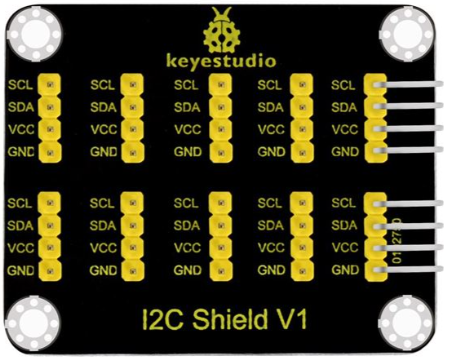

# Matriz de 8x8 LEDs
Antes de nada vamos a indicar que en este conjunto de actividades denominado "Otros dispositivos I2C" vamos a conectar mas elementos I2C a nuestra placa de control y para la expansión del conector I2C que integra la placa TdR STEAM utilizamos la shield de conversión I2C que vemos en la imagen siguiente.

*Hub I2C*

El conexionado entre la placa TdR STEAM y la shield la tenemos que hacer con un un cable formado por cuatro conductores que en un extremo lleva un conector JST Macho de 4 pines (TdR) y en el otro un conector plano hembra también de 4 pines de tipo dupont. El conector JST solamente puede colocarse en una posición y por lo tanto no hay posibilidad de error. Para colocar el conector plano nos fijamos en el nombre de uno de sus extremos en la shield y lo hacemos coincidir con el cable que corresponda en el conector JST, lo colocamos en su sitio y tenemos resuelta la conexión.

## Enunciado
En esta actividad el objetivo es conocer la LEDMatrix 8x8 o también llamada matriz de LEDs.

Es una pantalla en la que podemos programar diferentes símbolos o elementos, como: caras, iconos, letras... Hay opciones prediseñadas desde ArduinoBlocks y también, existe la opción de crearlos personalizados.

## Teoría
Una distribución de 8x8 LEDs en forma de matriz permite crear una pantalla pequeña que tiene 64 LEDs con el aspecto de la Figura siguiente y se conecta al puerto de comunicación I2C.

*[Aspecto de la matriz de 8x8*

Este tipo de matrices son 'multiplexadas', por lo que para controlar 64 LED necesitas 16 pines y eso son muchos pines aunque hay chips de controladores como el MAX7219 que pueden controlar una matriz, pero aún así hay mucho cableado que configurar y ocupan muchos pines. Para solucionar esto se utiliza un chip de control que tiene un reloj incorporado para multiplexar la pantalla. Además del módulo utiliza una fuente de corriente constante que permite obtener un color uniforme y brillante de todos los diodos. El conjunto forma una matriz de 8x8 que se controla a través de una interfaz I2C.

Sus principales características son:

* Matriz de LEDs de 8 filas y 8 columnas
* Direccionada por un chip HT16K33
* Conexión tipo I2C
* Tensión de alimentación: 5V
* Frecuencia de trabajo: 400KHz
* Potencia de entrada: 2.5W
* Corriente de entrada: 500mA

También existen matrices que son direccionables , como la que vemos en la imagen siguiente:

*Aspecto de la matriz de 8x8 direccionable*

El dispositivo dispone de su propio menú de bloques y de un diseñador de mapas de bits similar al visto para los símbolos de la LCD que podemos apreciar en la figura siguiente:

*Bloques para la matriz 8x8 y diseñador*

## Programando la actividad
Vamos a hacer un programa que cuando pulsemos el botón SW1 de la TdR STEAM la matriz muestre una carita sonriente, cuando pulsamos el SW2 una carita triste y si no pulsamos ninguno que nos muestre un corazón latiendo. El programa de la imagen siguiente esta disponible como [Caritas](./programas/caritas.abp).

*Caritas y corazón latiendo*

