# Lo que vamos a necesitar
Relacionamos el equipamiento mínimo que se requiere para comenzar a trabajar y se recomiendan algunas cosas mas.

## Software
Para llevar a cabo la **programación** de los **retos** es necesario estar registrado en **ArduinoBlocks** y se recomienda hacerlo con un nombre real para posteriormente facilitar la localización si es necesaria y se tiene que hacer con un correo real pues se necesita confirmación para crear la cuenta.

* La tarea es sencilla y está perfectamente descrita en el Free Book (online & updated) que podemos encontrar en los recursos de la plataforma www.arduinoblocks.com.
* Creamos un "nuevo usuario" utilizando para ello una cuenta de correo válida donde vamos a recibir un correo de confirmación para activarla.
* Ya estamos en condiciones de crear nuestros propios proyectos en la plataforma como veremos mas adelante.

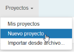

*Crear un nuevo proyecto*

* Descarga e instala en tu ordenador y para tu sistema operativo la última versión de [ArduinoBlocks - Connector](http://www.arduinoblocks.com/web/site/abconnector5). Este programa vamos a necesitarlo para poder comunicar nuestra placa con la plataforma a través del puerto USB de nuestro ordenador.

El programa debe estar en ejecución, minimizado para que no nos moleste, siempre que queramos grabar un programa y tiene el aspecto que vemos en la figura siguiente:

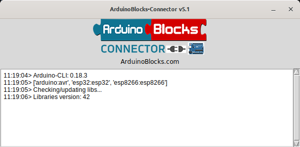

*ArduinoBlocks Connector*

### Hardware imprescindible
Una placa Imagina TdR STEAM versión 2.0 como la de la imagen siguiente:

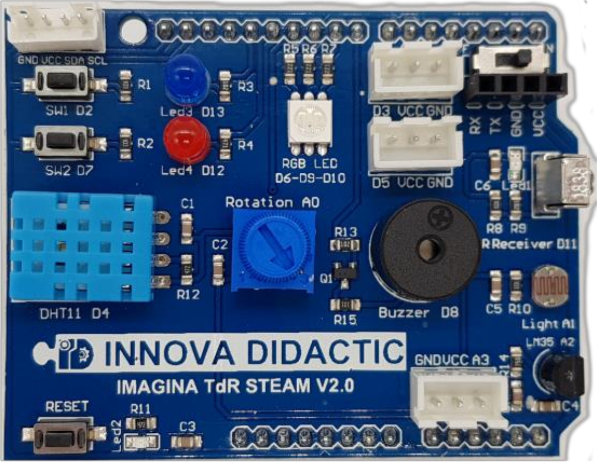

*Shield TdR-STEAM V2.0*

Una placa ESP32 Plus STEAMakers.

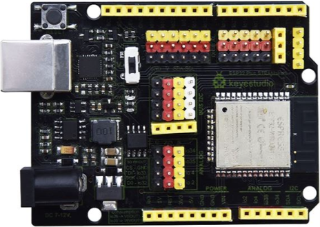

*ESP32 Plus STEAMakers*

### Hardware recomendado
A continuación exponemos el material adicional que vamos a emplear en esta colección de retos que no es otro que el incluido en el [Kit Imagina TdR STEAM](https://shop.innovadidactic.com/es/para-centros-educativos/1445-kit-imagina-tdr-steam-basado-en-arduino.html) comercializado por la empresa [INNOVA DIDACTIC](https://shop.innovadidactic.com/es/).

* Mando de control remoto por infrarojos para utilizar en conjunto con el sensor de infrarojos integrado en la placa TdR-STEAM.

*Mando a distancia por IR*

* Pantalla LCD 1602 IIC (I2C) de 2 línea de 16 caracteres. Nos va a permitir mostrar mensajes de texto e irá conectada al conector I2C de la placa TdR-STEAM.

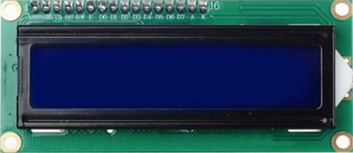

*LCD 1602 I2C*

* Sensor de sonido analógico (con potenciometro). Se utiliza básicamente para detectar el nivel sonoro ambiental. El potenciometro permite ajustar el nivel de ganancia.

*Sensor de sonido analógico*

## Caja contenedor imprimible 3D

### Partes
La caja está compuesta de una base, una tapa, tres tornillos y un destornillador. La base con indicación de donde va a ir cada elemento la vemos en la imagen siguiente:

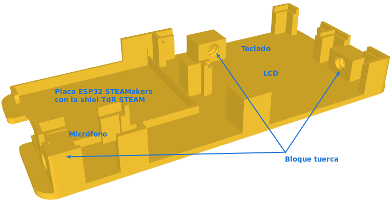

*Base o caja*

El aspecto de la tapa lo tenemos en la imagen siguiente, donde podemos observar el orificio estriado que servirá para colocar el destornillador cuando finalicemos el montaje.

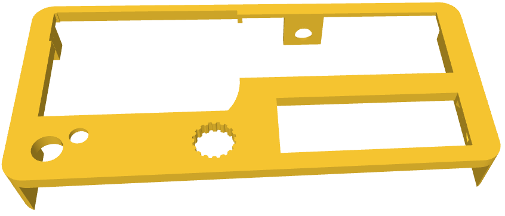

*Tapa*

Finalmente en la imagen siguiente podemos ver el aspecto de los tres tornillos que sujetan la tapa a la caja y el del destornillador.

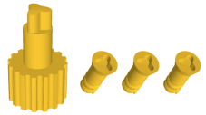

*Tornillos y destornillador*

## **Archivos stl listos para descargar e imprimir**
Los archivos de diseño original son los siguientes:

* Archivo STL de la caja: [caja.stl](caja-TdR-STEAM/caja.stl)
* Archivo STL de la tapa: [tapa.stl](caja-TdR-STEAM/tapa.stl)
* Archivo STL del tornillo: [tornillo.stl](caja-TdR-STEAM/tornillo.stl)
* Archivo STL del destornillador: [destornillador.stl](caja-TdR-STEAM/destornillador.stl)
* Todos los archivos en un zip: [caja-TdR-STEAM.zip](caja-TdR-STEAM/caja-TdR-STEAM.zip)

Algunos de los archivos anteriores se han modificado para mejorar el diseño en algunos aspectos y sobre todo para dejar libre un hueco en la base que haga accesible la tarjeta uSD. Los <b>archivos modificados</b> son los siguientes:

* Archivo FreeCAD con las modificaciones: [modificaciones.FCStd](caja-TdR-STEAM/modificada/modificaciones.FCStd)
* Archivo STL de la caja modificada: [caja.stl](./caja-TdR-STEAM/modificada/caja.stl)
* Archivo STL de la tapa: [tapa.stl](./caja-TdR-STEAM/modificada/tapa.stl)
* Archivo STL del tornillo: [tornillo.stl](./caja-TdR-STEAM/modificada/tornillo.stl)
* Archivo STL del destornillador: [destornillador.stl](./caja-TdR-STEAM/modificada/destornillador.stl)
* Todos los archivos en un zip: [caja-TdR-STEAM.zip](./caja-TdR-STEAM/modificada/modificada.zip)

## **Pasos de montaje**
Las imágenes siguiente se corresponden con el montaje y los elementos originales utilizando una placa tipo UNO pero son perfectamente válidas puesto que son los mismos elementos y la placa TDRSTEAM tiene formato UNO.

* **Paso 1**. Colocamos la TdR STEAM sobre la placa UNO pasando el cable de cuatro hilos entre ambas y colocando el conector JST de 4 pines en la TdR STEAM (este conector solamente entra en una posición) para obtener algo similar a la imagen siguiente:

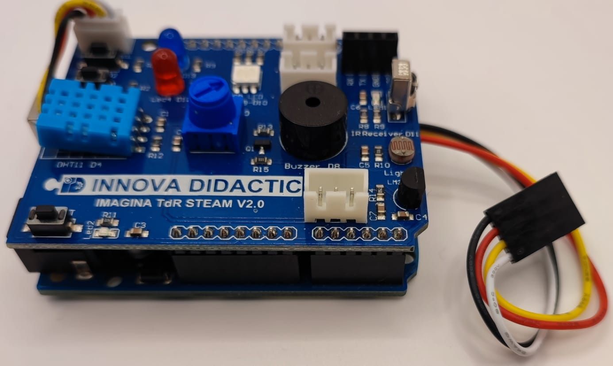

*Montaje de la TdR STEAM sobre UNO conectando el I2C*

* **Paso 2**. Conectamos la LCD mediante el conector plano de 4 pines asegurando que el cable negro va al pin marcado como GND. Hay que tener precaución con la orientación de este conector pues es reversible. El resultado debe ser similar al siguiente:

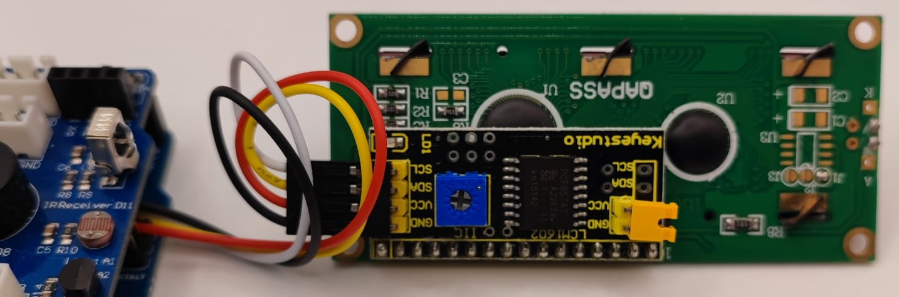

*Montaje de la LCD*

* **Paso 3**. En la imagen siguiente se ven los elementos anteriores colocados en su lugar.

*Montaje de Shield+UNO y LCD en la base*

* **Paso 4**. Conectamos un cable de tres hilos al micrófono teniendo en cuenta que el cable negro va al terminal marcado con una G y el otro extremo del cable lo colocamos en el conector JST de 3 pines marcado con A3. Pasamos los cables por debajo de la LCD y el resultado será algo similar a lo siguiente:

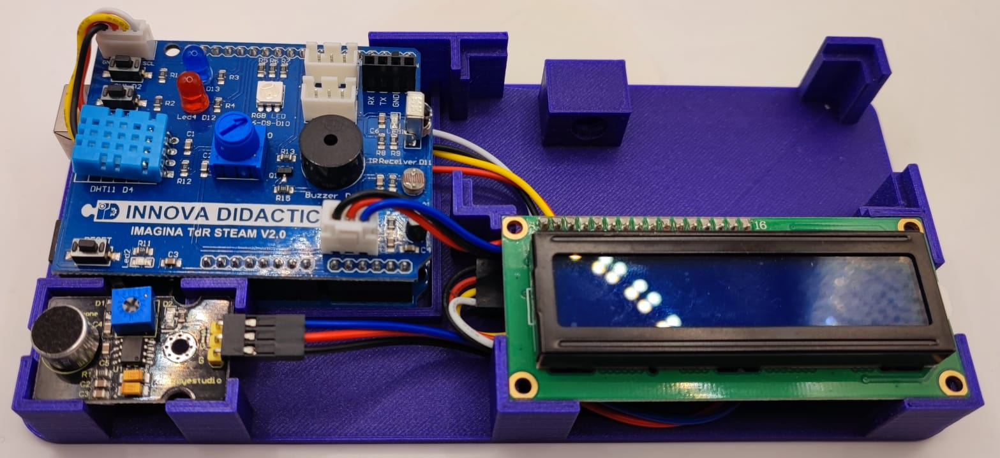

*Montaje de micrófono*

* **Paso 5**. Colocamos el teclado en su lugar.

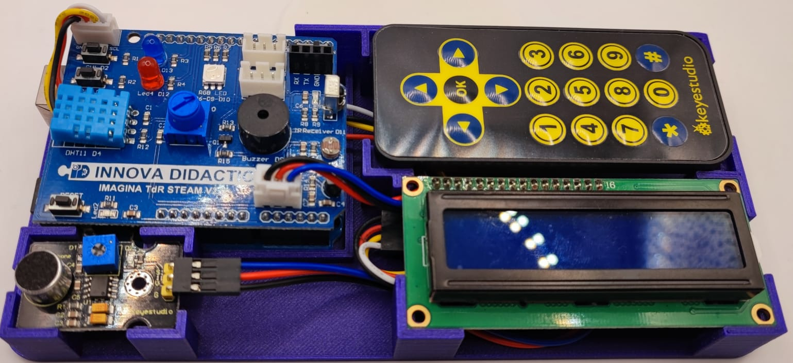

*Colocación del mando a distancia*

* **Paso 6**. Finalmente colocamos la tapa y atornillamos cada tornillo en su tuerca, los apretamos con ayuda del destornillador y colocamos este en su alojamiento. Tendremos finalizada la colocación de elementos en la caja, tal y como vemos a continuación:

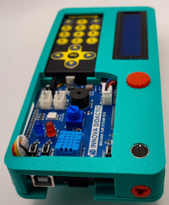

*Montaje finalizado*

