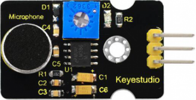
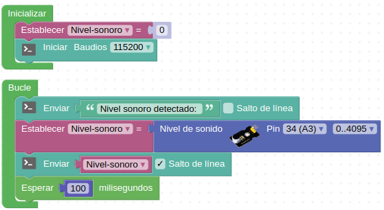

# LEDs RGB direccionables
Comunmente se les conoce como Neopixel, que es una marca registrada por [Adafruit Industries](https://www.adafruit.com/). Cada LED que componen la tira o matriz tiene los siguientes cuatro pines:

* Alimentación VDD: 5V
* Tierra: GND
* DI (Date Input): pin para recibir información
* DO (Date Output): pin para enviar inforamción

Cada uno de los LEDs es direccionable de manera individual gracias al circuito electrónico que incluyen que, con una memoria de un byte por color, que es un circuito lógico. Los tipos mas comunes son el SK6812, WS2811 o, el mas habitual de todos, el WS2812 cuyo [datasheet](./Datasheet/WS2812B.pdf) tenemos en el enlace.

## Enunciado
Realizaremos varios ejemplos de uso utilizando la tira de 8 LEDs que incluye el kit, aunque se realiza un estudio teórico amplio que será útil para cualquier tira o matriz de de LEDs RGB direccionables.

## Teoría
El WS2812B incluye un oscilador interno de precisión y un circuito de control de corriente constante programable de 12 V, lo que garantiza de manera efectiva que la intensidad del color sea consistente. El protocolo de transferencia de datos utiliza un único modo de comunicación de multiplexado NZR.

Para transmitir información digital esta se debe sincronizar mediante una convención especial, la codificación. Dos dispositivos llevan una comunicación por cable convirtiendo la información a transmitir en un flujo de bits (0 y 1) o "Dates" que se suele nombrar con la letra D y que va acompañada de una señal de reloj para sincronizar las transmisiones. La forma convencional de transmisión digital se componen de una línea de datos mas una línea de reloj. Ahora bien, cualquier ligera desviación en la longitud de estas líneas hará que el receptor no cumpla con el tiempo de establecimiento del muestreo de datos, originando errores en los datos. La forma de asegurar que esas líneas son idénticas es que sean la misma línea, lo que hace que aparezcan códigos que fusionan los datos y el reloj, entre los que están los código RZ, NRZ y NRZI que vamos a ver someramente a continuación.

* **Codificación RZ**. El acrónimo de de "Return Zero" o retorno cero y su característica es que se transmiten bits de datos dentro de cada periodo de la señal. En la figura siguiente los datos se representan en rojo y vemos que ocupan una parte del periodo T, siendo cero el resto del tiempo. Este sistema se denomina RZ unipolar.

*Código RZ unipolar*

Después del reinicio de encendido del píxel, el puerto DIN recibe datos del controlador, el primer píxel recopila datos iniciales de 24 bits y luego se envía al pestillo de datos interno,
los otros datos que remodelan por el circuito de amplificación de remodelación de señal interna enviados al siguiente cascadepixel a través del puerto DO. Después de la transmisión de cada píxel, la señal se reduce a 24 bits. Pixel adopta la tecnología de transmisión de autosha-ping, lo que hace que el número de cascada de píxeles no se limite a la transmisión de la señal, solo depende de la velocidad de transmisión de la señal.
LED con bajo voltaje de conducción, protección del medio ambiente y ahorro de energía, alto brillo, ángulo de dispersión es grande, buena consistencia, baja potencia, larga vida útil y otras ventajas. El chip de control integrado en LED por encima de convertirse en un circuito más simple, pequeño volumen, instalación conveniente.

*Sensor de sonido con micrófono KS0035 con potenciómetro*

## Programando la actividad
Como programa sencillo inicial vamos simplemente a enviar a la consola el nivel de sonido que detecte nuestro micrófono. El programa de la imagen siguiente esta disponible como [ESP32-SM-micro-inicial](./programas/ESP32-SM-micro-inicial.abp).

*Actividad inicial con el micro*

## Retos de ampliación

**Micro.R1**. Modificar el programa de la actividad inicial para que muestre los datos por la LCD.

**Micro.R2**. Partiendo del programa del reto 2 de la actividad LCD (LCD.R2) modificarlo para que muestre los datos del micrófono tanto al final de la cuenta ascendente como de la descendente.
