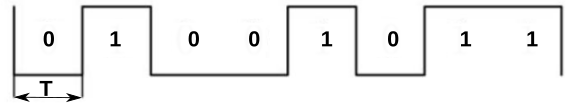
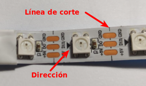
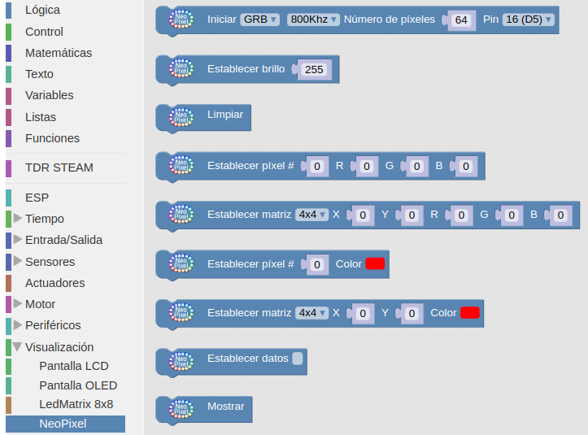

# LEDs RGB direccionables
Comunmente se les conoce como Neopixel, que es una marca registrada por [Adafruit Industries](https://www.adafruit.com/). Cada LED que componen la tira o matriz tiene los siguientes cuatro pines:

* Alimentación VDD: 5V
* Tierra: GND
* DI (Date Input): pin para recibir información
* DO (Date Output): pin para enviar inforamción

Cada uno de los LEDs es direccionable de manera individual gracias al circuito electrónico que incluyen que, con una memoria de un byte por color, que es un circuito lógico. Los tipos mas comunes son el SK6812, WS2811 o, el mas habitual de todos, el WS2812 cuyo [datasheet](./Datasheet/WS2812B.pdf) tenemos en el enlace.

## Enunciado
Realizaremos varios ejemplos de uso utilizando la tira de 8 LEDs que incluye el kit, aunque se realiza un estudio teórico amplio que será útil para cualquier tira o matriz de de LEDs RGB direccionables.

## Teoría
El WS2812B incluye un oscilador interno de precisión y un circuito de control de corriente constante programable de 12 V, lo que garantiza de manera efectiva que la intensidad del color sea consistente. El protocolo de transferencia de datos utiliza un único modo de comunicación de multiplexado NZR.

En la figura siguiente vemos el aspecto de un diodo LED RGB individual en formato inserción y SMD.

*Aspecto de un diodo LED RGB*

### Aspectos previos
Para transmitir información digital esta se debe sincronizar mediante una convención especial, la codificación. Dos dispositivos llevan una comunicación por cable convirtiendo la información a transmitir en un flujo de bits (0 y 1) o "Dates" que se suele nombrar con la letra D y que va acompañada de una señal de reloj para sincronizar las transmisiones. La forma convencional de transmisión digital se componen de una línea de datos mas una línea de reloj. Ahora bien, cualquier ligera desviación en la longitud de estas líneas hará que el receptor no cumpla con el tiempo de establecimiento del muestreo de datos, originando errores en los datos. La forma de asegurar que esas líneas son idénticas es que sean la misma línea, lo que hace que aparezcan códigos que fusionan los datos y el reloj, entre los que están los código RZ, NRZ y NRZI que vamos a ver someramente a continuación.

* **Codificación RZ**. El acrónimo de de "Return Zero" o retorno cero y su característica es que se transmiten bits de datos dentro de cada periodo de la señal. En la figura siguiente los datos se representan en rojo y vemos que ocupan una parte del periodo T, siendo cero el resto del tiempo. Este sistema se denomina RZ unipolar o retorno a cero unipolar y como se observa en la figura un nivel bajo indica 0 y un nivel positivo indica 1.

*Código RZ unipolar*

El código de retorno a cero se divide en un código de retorno a cero unipolar y un código de retorno a cero bipolar en el que el nivel alto indica 1 y el nivel negativo o, tal y como vemos en la figura siguiente:

*Código RZ bipolar*

* **Codificación NRZ**. El acrónimo es de "Not Return Zero" o código sin retorno a cero y se diferencia del RZ en que no necesita retornar a cero. En la figura siguiente vemos gráficamente el código.

*Código NRZ*

En el datasheet estos código se denominan T0H y T0L.

El funcionamiento de una agrupación en cascada como la de la figura siguiente se puede resumir diciendo que: el circuito integrado de cada LED puede almacenar 3 bytes (24 bits), un byte para cada color. Solo el primer LED está conectado al Pin de control, en este caso, un pin digital de nuestra placa, que enviará la cadena de todos los colores según el número de pixeles que estén conectados y a su vez el primer LED recibirá la información de todos los colores uno tras otro. La información se transmite de un LED a otro porque cuando un LED recibe 3 bytes nuevos de información entrega al siguiente LED los 3 bytes que contenía anteriormente, de esta manera cuando la placa con el programa termina de mandar todos los colores por el pin de datos el primer LED habría recibido y enviado todos los colores para quedarse finalmente con el color que le corresponde y así el resto de LEDs. De esta forma una tira de LEDs RGB direccionables es un dispositivo digital de salida, es decir su funcionamiento consiste en recibir la información del color a mostrar y mostrarlo.

*Conexión en cascada*

### Aspectos técnicos
Los LEDs RGB direccionables se suelen suministrar en tiras de diferentes longitudes y con distinto número de LEDs y a veces se dispone la tira en forma de matriz. En la figura siguiente vemos el aspecto de algunos tipos.

*Tira y matriz de LEDs RGB*

Tienen 3 cables asociados a un conector y dos cables extra para añadir alimentación externa cuando es necesario porque la placa de control no entrega suficiente corriente para alimentar al conjunto. Cuando se trabaja con una tira de pocos LEDs no es necesario añadir esta alimentación externa, ya que placas como Arduino UNO o la ESP32 STEAMakers pueden suministrar la corriente que necesitan.

Para los ejemplos mas básicos vamos a utilizar una tira de 8 LEDs como la que vemos en la figura siguiente:

*Tira de ocho LEDs RGB*

Cualquier tira de LEDs RGB (sea cual sea su disposición en línea, como matriz, etc) debe utilizarse siempre en la dirección que marca el terminal hembra como entrada y el conector macho como salida. Las podemos ir conectando entre sí pero siempre respetando este sentido de la tira. Junto a cada led RGB está indicada la dirección de la tira mediante un triángulo y también a qué pin debe ir conectado cada cable. Vemos +5V que corresponde a Vcc, GND, y en medio que pone Din o D0 que corresponde al pin digital de entrada de datos que debemos conectar al pin de salida de la placa de control.

También las podemos cortar por cualquiera de las líneas existentes entre cada uno de los LEDs y que está marcado con la línea de corte. El corte debe hacerse dejando la mitad del pad de cobre a un lado y otro de la línea y así poder unir después entre ellas con conectores especializados o soldándolas.

*Dirección y línea de corte*

### Bloques en ArduinoBlocks
En la figura siguiente vemos el menú bloques disponible en 'Visualización' en su entrada 'NeoPixel'.

*Bloques LEDs RGB direccionables*

* **Iniciar**: Este bloque se debe definir dentro del bloque “inicializar” o “setup” para indicar la configuración los LEDs conectados. Tenemos que indicar los siguientes parámetros:
    - *Frecuencia*: 800Khz / 400Khz, es la velocidad del “bistream” con los datos que se envían a través del pin DIN con los datos para cada neopíxel. Una tasa de 400khz ya permitiría controlar más de 1000 leds con un refresco de 30fps.
    - *Número de píxeles*: indica el número de píxeles conectados en serie, si conectamos una tira de 100 LEDs lo indicaremos en este valor.
    - *Pin*: es el pin a través el cual la placa de control enviará y controlará los datos de los LEDs.

* **Establecer brillo**: Valor entre 0 y 255 que establece con que potencia emiten luz los LEDs.

* **Limpiar**: Apaga todos los LEDs conectados en serie.

* **Establecer píxel**: Permite fijar un píxel (LED) en concreto de toda la serie a un color, indicando el número del mismo (el primero es el 0) y los valores R,G y B (0...255) o seleccionando el color.

* **Establecer matriz**: Funciona de forma similar al anterior, pero en caso de usar una matriz de LEDs podemos indicar el píxel a modificar mediante sus coordenadas X,Y y los valores R,G,B (0...255).

* **Establecer datos**: Permite rellenar una matriz de LEDs a partir de un “bitmap” de datos. Con el botón derecho nos dirigimos a la opción “Ayuda” para abrir el editor para obtener los datos del “bitmap”.

En la figura siguiente se observa como crear una imagen en una matriz de 8x8.

Y en la siguiente vemos una imagen de estas notas cargada para una matriz de 64x32.

* **Mostrar**: Actualizar los datos enviados a los LEDs. Cualquier operación no se reflejará hasta que se ejecute el bloque “mostrar”. Esto se realiza por una cuestión de optimización, así podemos realizar varias operaciones internamente y mostrarla a la vez en una sola operación.

## Programando la actividad
En esta ocasión vamos a ver una serie de ejemplos resueltos para desarrollar la actividad desde lo más básico en los que iremos dando explicaciones concretas que se requieran para ese ejemplo.

### Actividades básicas

* **A1. Encender un LED RGB**

Este es el programa mas simple que podemos hacer con una tira. En el enlace tenemos el programa [A1. Encender un LED RGB](./programas/Actividades-neop/A1.abp) siguiente:

*Programa A1. Encender un LED RGB*

Recuérdese siempre que los LEDs se numeran empezando por 0, es decir índice 0. El bloque 'Mostrar' es imprescindible pues el bloque 'Establecer pixel #' lo único que hace es indicar el color en caso de que el LED se ilumine pero realmente quien lo enciende es 'Mostrar'.

* **A2. Encender todos los LEDs de una tira**

En el enlace tenemos el programa [A2. Encender todos los LEDs de una tira](./programas/Actividades-neop/A2.abp) siguiente:

*Programa A2. Encender todos los LEDs de una tira*

El programa utiliza un contador de 0 a 7 para recorrer los 8 LEDs de la tira y establecer su color. Una vez finalizada la operación de asignar color se encienden los LEDs. También vemos que la variable 'i' no la tenemos que crear porque se crea automáticamente al utilizar el bloque 'Contar'.

* **A3. Encender los LEDs de una tira de uno en uno**

Vamos a hacer que los LEDs se enciendan de uno en uno con un pequeño retardo y que cuando estén todos encendidos, se apaguen y vuelva a empezar el ciclo. En el enlace tenemos el programa [A3. Encender los LEDs de una tira de uno en uno](./programas/Actividades-neop/A3.abp) siguiente:

*Programa A3. Encender los LEDs de una tira de uno en uno*

Establecer el color en negro es apagar el LED.

* **A4. Encender y apagar los LEDs de una tira de uno en uno**

Vamos a hacer que los LEDs se enciendan de uno en uno con un pequeño retardo y que cuando estén todos encendidos, se apaguen en el orden inverso al de encendido también con un pequeño retardo. Una vez apagados permanecerán así durante tres segundos antes de iniciar el ciclo de nuevo. En el enlace tenemos el programa [A4. Encender y apagar los LEDs de una tira de uno en uno](./programas/Actividades-neop/A4.abp) siguiente:

*Programa A4. Encender y apagar los LEDs de una tira de uno en uno*

El apagado de los LEDs lo hacemos con un contador decreciente o decontador.

* **A5. Desplazar el LED encendido**

Vamos a hacer que los LEDs se enciendan de uno en uno pero desplazando el LED encendido, es decir apagando el anterior y esperando un segundo entre cambio de LED. En el enlace tenemos el programa [A5. Desplazar el LED encendido](./programas/Actividades-neop/A5.abp) siguiente:

*Programa A5. Desplazar el LED encendido*

* **A6. Desplazar el LED encendido en dos sentidos**

Vamos a hacer que los LEDs se enciendan de uno en uno pero desplazando el LED encendido, es decir apagando el anterior y cuando lleguemos al final recorremos la tira pero a la inversa. En el enlace tenemos el programa [A6. Desplazar el LED encendido en dos sentidos](./programas/Actividades-neop/A6.abp) siguiente:

*Programa A6. Desplazar el LED encendido en dos sentidos*

* **A7. Encender todos los LEDs con color aleatorio**

En este caso vamos a crear tres variables nombradas R, G y B. El bloque de generación de números aleatorios lo encontramos en 'Matemáticas' y haremos que cada variable pueda tomar valores entre 0 y 255 que son los posibles valores para cada color. Para que todos tengan el mismo color tenemos que definir el valor de las variables y luego encender los LEDs. En el enlace tenemos el programa [A7. Encender todos los LEDs con color aleatorio](./programas/Actividades-neop/A7.abp) siguiente:

*A7. Encender todos los LEDs con color aleatorio*

* **A8. Encender cada LED con un color aleatorio diferente**

Es el mismo caso que la actividad anterior pero llevando la generación de valores aleatorio al interior del bucle, lo que hará que cada LED se encienda de un color diferente. En el enlace tenemos el programa [A8. Encender cada LED con un color aleatorio diferente](./programas/Actividades-neop/A8.abp) siguiente:

*A8. Encender cada LED con un color aleatorio diferente*

* **A9. Encender en un color un LED aleatorio**

Se trata de establecer un color para el pixel y que de forma aleatoria cambien el diodo que se enciende. En el enlace tenemos el programa [A9. Encender en un color un LED aleatorio](./programas/Actividades-neop/A9.abp) siguiente:

*A9. Encender en un color un LED aleatorio*

* **A10. Encender en un color aleatorio un LED aleatorio**

Repetir la actividad A9 pero haciendo que el color sea también aleatorio. En el enlace tenemos el programa [A10. Encender en un color aleatorio un LED aleatorio](./programas/Actividades-neop/A10.abp) siguiente:

*A10. Encender en un color aleatorio un LED aleatorio*

### Actividades de control con sensores de TdR STEAM
Después de ver como generar diferentes efectos con la tira de LEDs RGB direccionables, ahora vamos a ver como hacer que diferentes sensores de los que contiene la placa TdR STEAM pueden hacer cambiar los efectos en la tira.

* **A11. Avanzar el LED encendido al accionar un pulsador**

Se trata de hacer que el LED encendido cambie al siguiente cada vez que accionamos el pulsador SW1 (o SW2) en la placa TdR STEAM. También vamos a hacer que cuando los LEDs avancen lo hagan en grupo. Para ello lo que hacemos es que se iluminen al mismo tiempo los LEDs que corresponden a la variable, pero también los de la variable+1, variable+2,... En el enlace tenemos el programa [A11. Avanzar el LED encendido al accionar un pulsador](./programas/Actividades-neop/A11.abp) siguiente:

*A11. Avanzar el LED encendido al accionar un pulsador*

* **A12. Ajustar el brillo de los LEDs con el potenciómetro**

Vamos a hacer que los LEDs cambien su luminosidad o brillo en función de una variable analógica basada en el potenciómetro. En el enlace tenemos el programa [A12. Ajustar el brillo de los LEDs con el potenciómetro](./programas/Actividades-neop/A12.abp) siguiente:

*A12. Ajustar el brillo de los LEDs con el potenciómetro*

De forma similar podemos hacer que los cambios se realicen en función de otras variables analógicas.

* **A13. Cambiar de color según el nivel de luz**

Vamos a hacer que los LEDs cambien de color en función de la luz detectada por la LDR. Con el sensor destapado veremos luz verde que irá tendiendo al amarillo según baje el nivel de iluminación que recibe la fotocélula. En el enlace tenemos el programa [A13. Cambiar de color según el nivel de luz](./programas/Actividades-neop/A13.abp) siguiente:

*A13. Cambiar de color según el nivel de luz*

Podemos jugar con la variable luz y otros valores y obtener colores diferentes. Por ejemplo, en la figura siguiente vemos un programa en el que se cambia el nivel de rojo mientras suena un pitido diferente según ese nivel.

*Cambiar de color y sonido según el nivel de luz*

Se ha puesto la duración de la nota a un tiempo muy bajo para que el sensor LDR responda (lea valores) sin necesidad de esperar un tiempo largo a que termine la nota.

* **A14. Cambiar de color con control remoto**

Vamos a realizar mezclas de los colores básicos con la ayuda del mando a distancia. Haremos la siguiente asignación:

- Establecemos el brillo máximo (255) de los LEDs pulsando 1 para el rojo, 2 para el verde y 3 para el azul.
- Establecemos el brillo mínimo o apagado (0) de los LEDs pulsando 4 para el rojo, 5 para el verde y 6 para el azul.

En el enlace tenemos el programa [A14. Cambiar de color con control remoto](./programas/Actividades-neop/A14.abp) siguiente:

*A14. Cambiar de color con control remoto*

* **A15. Sensor de sonido**

Utilizaremos en este caso un sensor de sonido externo con el que vamos a captar el nivel de sonido ambiente en cada instante y sincronizarlo con la tira de LEDs a modo de vúmetro. En la placa TdR STEAM el sensor de sonido lo conectamos al pin A3. Para ver los valores numéricos utilizaremos la LCD I2C.

Si hacemos un programa como el de la figura siguiente podemos observar que es muy complicado ver en la pantalla en tiempo real los valores que lee el sensor porque tenemos que utilizar el bloque 'Esperar' para que podamos leerlo y eso complica leer los valores del sensor.

*Valores sensor de sonido*

Si llevamos la misma idea de programa a cambiar la iluminación de los LEDs si podremos ver los cambios en tiempo real porque no es necesario realizar esa pausa. En el enlace tenemos el programa [A15. Sensor de sonido](./programas/Actividades-neop/A15.abp) siguiente:

*A15. Sensor de sonido*

Lo que hacemos es mapear los posibles niveles de sonido al número de LEDs de la tira para después iluminar mas o menos los LEDs en un determinado color según el nivel de sonido. Observamos en el programa que tras establecer el color apagamos los LEDs encendidos. Lo hacemos de esta forma porque si utilizamos el bloque 'Limpiar' se produce un efecto de apagado y vuelta a encender que no deseamos.
