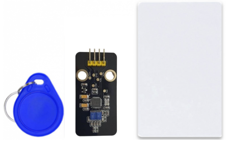
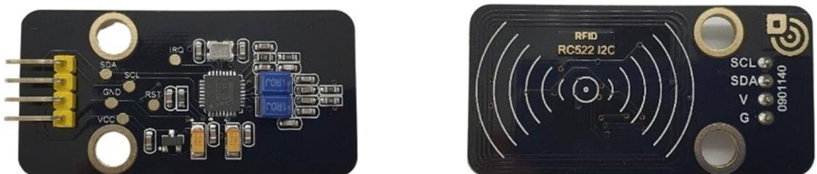
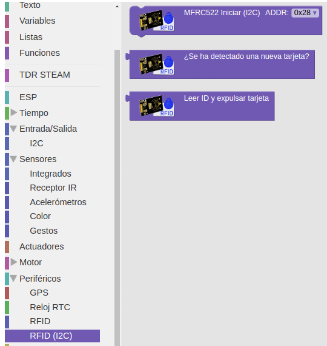
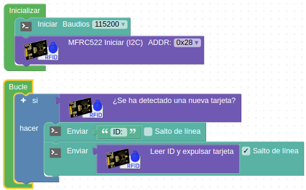
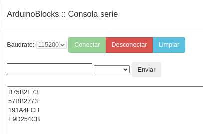
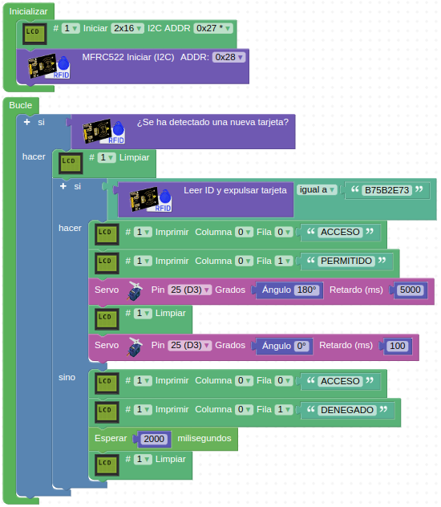
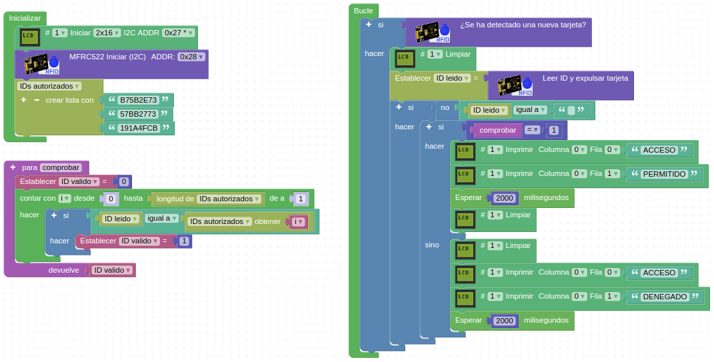
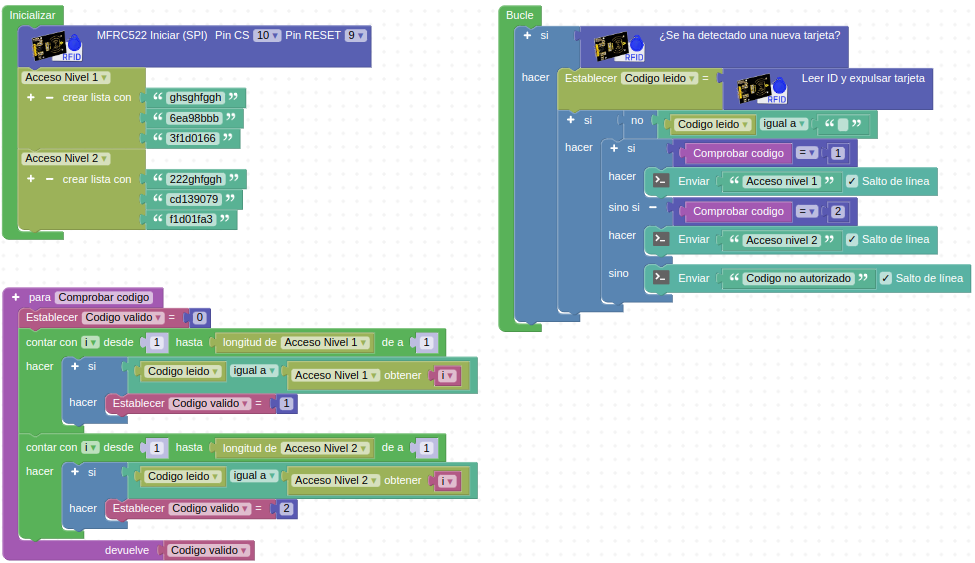

# Sensor RFID

## Enunciado
Detectar tarjetas y llaveros RFID mediante el sensor RC522 I2C. En la figura siguiente vemos los componentes habituales, el propio sensor y los dos [transpondedores](https://es.wikipedia.org/wiki/Transpondedor) que lo acompañan, el llavero y la tarjeta.

*Componentes del kit RFID*

También existen pegatinas, etiquetas y otros elementos compatibles de pequeño tamaño para trabajar con ropa o pequeños artículos.

## Teoría
RFID son las iniciales de Radio Frequency IDentification (identificación por radiofrecuencia) y es un sistema de identificación de productos que puede parecer similar al código de barras tradicional, pero que tiene grandes ventajas con respecto a este. A diferencia del código de barras que utiliza la imagen para identificar una etiqueta, el sistema RFID utiliza las ondas de radio
para comunicarse con un circuito electrónico. Puede estar montado sobre gran cantidad de soportes, como por ejemplo un tag o etiqueta RFID, una tarjeta o un transpondedor.

Un circuito RFID tiene una gran capacidad de almacenamiento de datos, por lo que permite guardar mucha más información que las etiquetas de código de barras tradicional. Su tecnología hace que sean muy difíciles de duplicar lo que aumenta su seguridad y permiten realizar la lectura de forma prácticamente instantánea, a distancia y sin necesidad de línea de visión.

El sensor RFID de nuestro caso está basado en el módulo MF522-AN de Philips. Es fácil de utilizar, de bajo costo y, adecuado para el desarrollo de equipos y el desarrollo de aplicaciones avanzadas para usuarios de lectores. Este módulo se puede conectar de forma sencilla a través de sus cuatro terminales, ya que utiliza un
sistema de comunicación I2C para conectarse a un microcontrolador.

En la figura siguiente vemos con mas detalle el aspecto del módulo sensor.

*Aspecto*

En la figura siguiente podemos ver los tres bloques necesarios para trabajar con RFID.

*Bloques*

El bloque superior inicializa la tarjeta e indica a que pines está conectada, el del centro es el encargado de decir si se ha detectado una tarjeta y el tercer bloque nos sirve para leer el código que tiene configurado nuestra tarjeta o llavero.

## Programando la actividad

* **Lector ID o código identificador**

En caso de detectar una tarjeta o llavero RFID cerca del lector, leeremos su ID y lo enviamos por la consola serie para visualizarlo. El programa de la imagen siguiente esta disponible como [lector](./programas/lector.abp).

*Programa lector ID RFID*

El programa genera el siguiente resultado para cuatro llaveros diferentes:

*Resultado programa lector ID RFID*

* **Abre puertas RFID**

Vamos a mover el servo 180º simulando la apertura de una puerta abatible. Para ello utilizaremos como válido uno de los llaveros de la actividad anterior y si el ID coincide con el programado el servo semoverá a la posición 180º y tras 5 segundos volverá al cero simulando que la puerta se ha cerrado.

El programa de la imagen siguiente esta disponible como [puerta](./programas/puerta.abp).

*Apertura de puerta con RFID*

* **Control de acceso de múltiples usuarios**

Esta actividad la vamos a resolver utilizando listas de texto, el bloque contar longitud de la lista y bucles contadores así como una función que comprobará el código y si es válido retornará un valor 1. El programa de la imagen siguiente esta disponible como [multiples](./programas/multiples.abp).

*Control de acceso de múltiples usuarios*

## Retos de ampliación

**RFID.R1**. Realiza un programa que muestra en una LCD el código identificador de llaveros y tarjetas que se acerquen al lector.

**RFID.R2**. Analizar y probar el funcionamiento del programa de gestión de múltiples usuarios con diferentes niveles de permisos. Podemos almacenar los códigos autorizados en diferentes listas y de esta forma establecer jerarquías de accesos, clasificaciones de materiales, ofertas, etc.

El programa de la imagen siguiente esta disponible como [2niveles](./programas/2niveles.abp).

*Control de acceso de múltiples usuarios con diferentes niveles*

