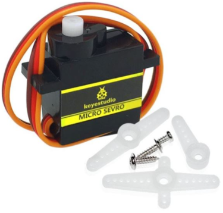
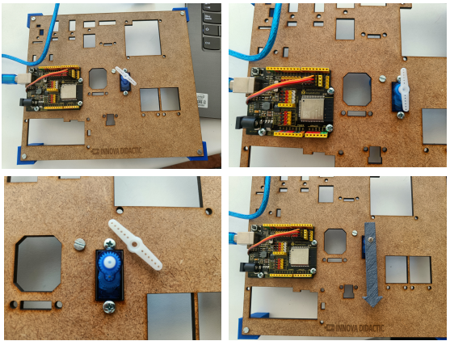

# El servomotor
Haremos diferentes movimientos del servomotor empleando funciones para distinguir un tipo de movimiento de otro.

## Teoría

### El servo
Un servomotor o abreviado servo es un motor especial que puede posicionar su eje en un ángulo determinado y lo puede mantener en esta posición. Los servos estándar suelen girar 180º, pero es habitual encontrar servos que giran 90º y otros 360º, que son los conocidos como servos de rotación continua. En el interior del mismo están ubicados tanto la electrónica de control como los engranajes reductores que a su vez pueden llevar o no topes físicos que marquen el ángulo de giro. Para su funcionamiento sólo necesitan ser alimentados (conexiones GND y VCC o 5V) y una señal de control.

Los servomotores son en realidad motores de corriente continua a los que se les ha añadido una reductora, para que giren más despacio y con más fuerza, y un controlador electrónico que permite hacer que gire un determinado ángulo. Además, el servo en todo momento sabe en qué posición está, aunque se apague o reinicie. Esto significa que si a un servo que hemos movido a un determinado punto, lo hemos dejado sin alimentación y al alimentarlo de nuevo le indicamos que gire 90º, no va a girar 90º sino que se va a dirigir a su posición de 90º que tiene memorizada internamente.

En la figura siguiente vemos el interior de un servo esquematizado.

*Interior de un servo 9g*

Su aspecto real lo vemos en esta otra figura, donde también se aprecian las palas y tornillería que lo acompañan.

*Aspecto real servo 9g*

Veamos su principio básico de funcionamiento: La electrónica de control del servomotor tiene un circuito de referencia incorporado que emite la señal de referencia, que es un ciclo de 20 ms con un ancho de pulso de 1,5 ms. Se compara la tensión de control recibida con la de referencia y se genera una diferencia de tensión. El circuito de control en la placa decidirá la dirección de rotación en consecuencia y accionará el motor. El sistema de engranajes o reductora convierten el giro del motor en un par de fuerza a través del eje. El sensor detecta que se ha alcanzado la posición enviada  de acuerdo con la señal de retroalimentación. Cuando la diferencia de tensión existe el motor gira y cuando la diferencia se reduce a cero, el motor se detiene. Normalmente, el ángulo de rotación es de 0 a 180 grados.

El servomotor viene con un conector hembra de tres pines para tres cables de conexión, que se distinguen por los colores marrón, rojo y naranja (diferentes marcas pueden tener diferentes colores).

El ángulo de rotación del servomotor se controla regulando el ciclo de trabajo de la señal PWM cuyo estándar es de 20 ms (50 Hz).

Hay que tener mucho cuidado de posicionar el conector de los servos en los tres pines macho de la shield en el orden correcto (el conector es reversible) o seguramente romperemos algo de manera irremediable.

Existe un tipo especial de servomotor que permite la rotación continua. En algunos casos se trata de servomotores “trucados” de forma que se modifican para permitir la rotación continua quitando los topes mecánicos y se sustituye el potenciómetro por un divisor de tensión con dos resistencia iguales (en algunos casos no se ponen resistencias y se bloquea el potenciómetro para que no gire dejándolo justo en su punto central). Este tipo de modificación la podemos realizar nosotros (en la web existen multitud de tutoriales) o también podemos comprar un servomotor de rotación continua listo para funcionar sin tener que hacer ningún tipo de bricolaje.

En el apartado de bloques de programación, se encuentra en "Motor / Servo" y en la figura siguiente vemos los bloques disponibles.

*Bloques para servos*

Para controlar el servomotor, indicamos los grados de rotación (Ángulo de giro) que queremos y el tiempo de retardo, o tiempo que tarda en ir de una posición a otra.

El control de un servomotor de rotación continua se realiza de igual manera, pero su reacción es diferente.

Los bloques Servo-Oscilador nos permiten de una forma sencilla hacer que el servo repita una secuencia de movimientos u oscilaciones de forma indefinida. Un ejemplo típico puede ser el que vemos en la figura siguiente, donde el servo oscila entre 0 y 90º en periodos de dos segundos.

*Oscilación con servo*

El bloque Servo-I2C (PCA9685) es simplemente un bloque para manejar la tarjeta controladora para 16 servos PCA9685 utilizando el bus I2C.

### Posicionar el servo 
Antes de fijar con el tornillo la pala y, en nuestro caso la flecha, debemos averiguar cual es su posición de 0º o inicial. Para ello vamos a crear el programa [Posicionar-servo](./programas/Posicionar-servo.abp) que vemos en la figura siguiente o que podemos importar del archivo del enlace.

*Buscar la posición 0º del servo*

Ejecutamos el programa que hemos cargado en la placa, y lo tenemos que parar en el momento que el servo vuelve a la posición inicial (hace un giro repentino de 180º tras un tiempo de espera mas largo). En ese momento, quitamos la flecha y el soporte tipo aspa vigilando de que no se modifique la posición del servo. Sin que el servomotor se haya movido, montamos el soporte blanco y la flecha, de forma que la flecha apunte hacia abajo, tal y como se muestra en la figura siguiente, donde se aprecia todo el proceso.

*Colocación de elementos en el servo*

### Listas
Las listas de datos nos permiten almacenar un listado de valores y acceder a ellos por su posición en la lista. Las listas pueden ser de tipo numéricas o de texto, como vemos en la imagen siguiente:

*Tipos de listas en ArduinoBlocks*

En la animación siguiente vemos el proceso de creación de una lista numérica y los elementos que se crean con la misma.

Los bloques que se crean nos permiten asignarle valores, saber el número de elementos que tiene una lista, obtener el valor de una posición de la lista o cambiar el valor de un elemento de la lista.

De forma muy similar se pueden crear y trabajar con lista de textos.

## Programando la actividad
Vamos a realizar un programa que vamos a dividir en varias partes:

* **Parte 1:** Mover el servo a partir de una lista de posiciones creada previamente.
* **Parte 2:** Mover de forma automática el servo entre 0 y 180 grados con retardos de un segundo.
* **Parte 3:** Mover el servo a la posición 180º con un pulsador y a la posición 0º con el otro.
* **Parte 4:** Mover el servo entre 0º y 180º utilizando el potenciómetro para ello.

Crearemos una función para cada apartado y serán llamadas de forma consecutiva. La solución la tenemos disponible en [ESP32-SM-Actividad-servo](./programas/ESP32-SM-Actividad-servo.abp) que es el programa que vemos en la imagen siguiente:

*Solución Actividad Servo*

Para probar las distintas partes vamos cambiando la función que se pone en bucle y cargando el programa en la placa.
