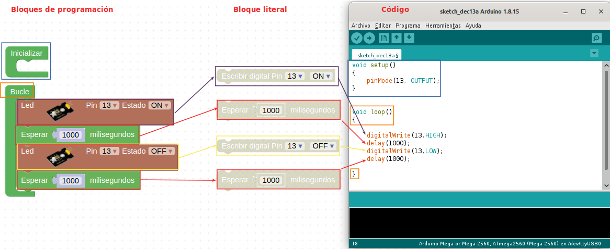

# Software
Vamos a utilizar el lenguaje de programación visual por bloques denominado ArduinoBlocks. El aspecto de la plataforma al entrar lo vemos en la imagen siguiente:

| Portada de la plataforma ArduinoBlocks |
|:|
|  |

Podemos programar nuestra placa de control tipo UNO de diversas formas de las que las mas comunes son, a partir del IDE de Arduino o mediante bloques, que será el método que sigamos. Programar mediante el IDE requiere teclear instrucciones de código mientras que con ArduinoBlocks estas instrucciones se sustituyen por bloques tipo puzzle que evitan errores de sintaxis. Evidentemente detrás de cada bloque en realidad lo que hay son instrucciones y ArduinoBlocks nos va a permitir verlas y exportarlas. En la imagen siguiente tenemos una comparativa entre bloques de código e instrucciones en el IDE.

| Comparativa entre bloques y código |
|:|
|  |

Es importante entender que la programación con ArduinoBlocks simplifica la iniciación en el pensamiento computacional permitiendo realizar tareas complejas de una forma sencilla.

Para el caso de la TdR STEAM cabe destacar que ArduinoBlocks incluye una serie de bloques específicos que facilitan aún mas si cabe su programación.

**ArduinoBlocks** trabaja a través de una plataforma online por lo que no requiere instalación en nuestro sistema. No obstante, si que tenemos que instalar un pequeño programa que será el encargado de conectar nuestro programa en el navegador con la placa Keyestudio UNO. Este programa basado en Python se llama **Connector**.

Lo primero que deberemos hacer es crear una cuenta en ArduinoBlocks utilizando una dirección de correo electrónico válida y después instalar el software [Connector](http://www.arduinoblocks.com/web/site/abconnector5).

En los manuales de referencia disponibles en la plataforma están todos los detalles sobre como llevar a cabo estas tareas. La versión 5 del programa una vez iniciado la vemos en la imagen siguiente:

| Connector V5 |
|:|
|  |

Si no estás muy avezado en estos temas es necesarios al menos ver los siguientes vídeos sobre el tema:

* Bloque 1: Puesta en marcha con ArduinoBlocks

    - [Empezando con ArduinoBlocks y la programación por bloques](https://didactronica.com/funcionamiento-de-un-programa-en-arduinoblocks-y-primera-carga/)
    - [Crear una cuenta en ArduinoBlocks e iniciar un proyecto personal](https://didactronica.com/crear-una-cuenta-en-arduinoblocks-e-iniciar-un-proyecto-personal/)
    - [Configurar la conexión a ArduinoBlocks y detectar la placa Arduino](https://didactronica.com/configurar-la-conexion-a-arduinoblocks-y-detectar-la-placa-arduino/)
    - [Carga del primer programa](https://didactronica.com/carga-del-primer-programa/)
