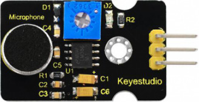
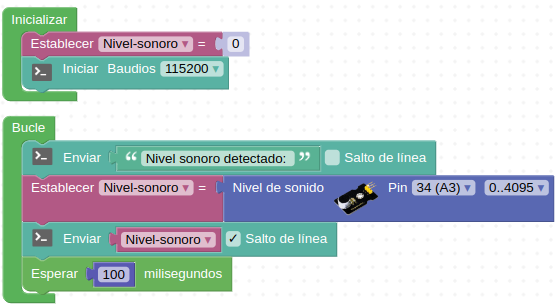

# Sensor de sonido o micrófono

## Enunciado
Realizaremos pruebas básicas de detección de nivel de sonido añadiendo esta opción externa al pin analógico A3 disponible en el conector correspondiente.

## Teoría
Un micrófono es un transductor (dispositivo que convierte energía de una forma a otra) que convierte la energía sonora en señales eléctricas. Micrófonos hay una amplia diversidad tanto en formas como tamaños. Dependiendo de la aplicación, un micrófono puede utilizar diferentes tecnologías para convertir sonidos en señales eléctricas.

Para el caso de aplicaciones con placas tipo Arduino suelen usarse sensores basados en el micrófono de condensador [electret](https://es.wikipedia.org/wiki/Micr%C3%B3fono_de_electreto) que es un condensador de placas paralelas y trabaja como una capacitancia variable. Se forma con una placa fija (placa trasera) y una movible (diafragma) con una pequeña separación entre ellas. Cuando el sonido golpea al diafragma este se mueve cambiando así la capacitancia entre las placas.

El sensor microfónico de keyestudio se utiliza normalmente para detectar el nivel de ruido en el ambiente. El pin S del mismo es una salida analógica, es decir, una tensión de salida en tiempo real del micrófono. El sensor viene con un potenciómetro que permite ajustar la ganancia de la señal dentro de un determinado rango. Su aspecto es el de la imagen siguiente:

*Sensor de sonido con micrófono KS0035 con potenciómetro*

## En la TdR STEAM

*El conector micrófono externo en A3*

## Programando la actividad
Como programa sencillo inicial vamos simplemente a enviar a la consola el nivel de sonido que detecte nuestro micrófono. El programa de la imagen siguiente esta disponible como [ESP32-SM-micro-inicial](./programas/ESP32-SM-micro-inicial.abp).

*Actividad inicial con el micro*

## Retos de ampliación

**Micro.R1**. Modificar el programa de la actividad inicial para que muestre los datos por la LCD.

**Micro.R2**. Partiendo del programa del reto 2 de la actividad LCD (LCD.R2) modificarlo para que muestre los datos del micrófono tanto al final de la cuenta ascendente como de la descendente.
